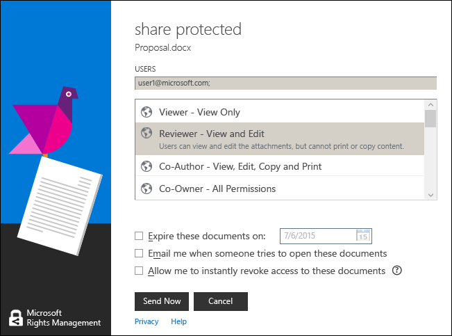

---
# required metadata

title: Keyboard shortcuts in the RMS sharing app - AIP
description: Instructions how to use keyboard shortcuts with the RMS sharing application for Windows.
author: cabailey
ms.author: cabailey
manager: mbaldwin
ms.date: 02/23/2017
ms.topic: conceptual
ms.service: information-protection
ms.assetid: 72760134-94e0-4699-b20c-07b96aa061f1

# optional metadata

#ROBOTS:
#audience:
#ms.devlang:
ms.reviewer: esaggese
ms.suite: ems
#ms.tgt_pltfrm:
#ms.custom:

---

# Use keyboard shortcuts in the Rights Management sharing application

>*Applies to: Active Directory Rights Management Services, [Azure Information Protection](https://azure.microsoft.com/pricing/details/information-protection), Windows 10, Windows 7 with SP1, Windows 8, Windows 8.1*

When you use the RMS sharing application, press the **Alt** key to see the available access keys, and then press **Alt** + the access key to select an option.

For example, in the **share protected** dialog box, press **Alt** to see the access keys, and then press **Alt + m** to select the **Email me when somebody tries to open these documents** check box.

## Examples and other instructions
For examples for how you might use the Rights Management sharing application, and how-to instructions, see the following sections from the Rights Management sharing application user guide:

-   [Examples for using the RMS sharing application](sharing-app-user-guide.md#examples-for-using-the-rms-sharing-application)

-   [What do you want to do?](sharing-app-user-guide.md#what-do-you-want-to-do)

## See Also
[Rights Management sharing application user guide](sharing-app-user-guide.md)
