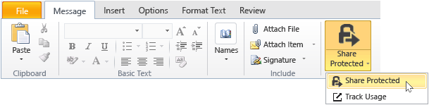
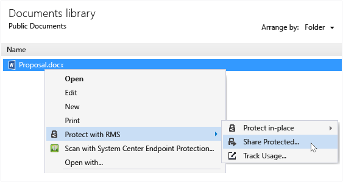
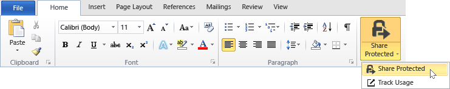
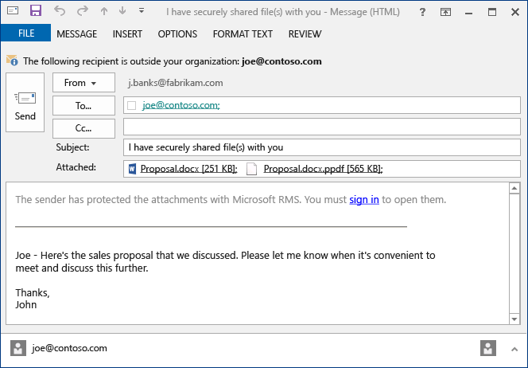

---
# required metadata

title: Share protected with the RMS sharing app - AIP
description: Instructions how to safely share a document by email.
author: cabailey
ms.author: cabailey
manager: mbaldwin
ms.date: 02/23/2017
ms.topic: conceptual
ms.service: information-protection
ms.assetid: 4c1cd1d3-78dd-4f90-8b37-dcc9205a6736

# optional metadata

#ROBOTS:
#audience:
#ms.devlang:
ms.reviewer: esaggese
ms.suite: ems
#ms.tgt_pltfrm:
#ms.custom:

---

# Protect a file that you share by email by using the Rights Management sharing application

>*Applies to: Active Directory Rights Management Services, [Azure Information Protection](https://azure.microsoft.com/pricing/details/information-protection), Windows 10, Windows 7 with SP1, Windows 8, Windows 8.1*

When you protect a file that you share by email, it creates a new version of the original file. The original file remains unprotected and the new version is protected and automatically attached to an email that you then send.

In some cases (for files that are created by Microsoft Word, Excel, and PowerPoint), the RMS sharing application creates two versions of the file that it attaches to the email message. The second version of the file has a **.ppdf** file name extension and it is a PDF shadow copy of the file. This version of the file ensures that recipients can always read the file, even if they don’t have the same application installed that you used to create it. This is often the case when people read their email on mobile devices, and want to view their email attachments. All they need to open the file, is the RMS sharing application. Then, they can read the attached file, but they won’t be able to change it until they open the other version of the file by using an application that supports a Rights Management service.

If your organization uses Azure Information Protection, you can keep track of the files that you protect by sharing:

-   Select an option to receive emails when somebody tries to open these protected attachments. Each time the file is accessed, you will be notified who tried to open the file and when, and whether they were successful (they were successfully authenticated) or not.

-   Use the documentation tracking site. You can even stop sharing the file, by revoking access to it in the document tracking site. For more information, see [Track and revoke your documents when you use the RMS sharing application](sharing-app-track-revoke.md).

## Using Outlook: To protect a file that you share by email

1.  Create your email message and attach the file. Then, on the **Message** tab, in the **RMS** group, click **Share Protected** and then click **Share Protected** again:

    

    If you do not see this button, it’s likely that either the RMS sharing application is not installed on your computer, the latest version isn’t installed, or your computer must be restarted to complete the installation. For more information about how to install the sharing application, see [Download and install the Rights Management sharing application](install-sharing-app.md).

2.  Specify the options that you want for this file in the [share protected dialog box](sharing-app-dialog-box.md), and then click **Send Now**.

### Other ways to protect a file that you share by email
In addition to sharing a protected file by using Outlook, you can also use these alternatives:

-   From File Explorer: This method works for all files.

-   From an Office application: This method works for applications that the RMS sharing application supports by using the Office add-in so that you see the **RMS** group on the ribbon.

#### Using File Explorer or an Office application: To protect a file that you share by email

1.  Use one of the following options:

    -   For File Explorer: Right-click the file, select **Protect with RMS**, and then select **Share Protected**:

        

    -   For the Office applications, Word, Excel, and PowerPoint: Make sure that you have saved the file first. Then, on the **Home** tab, in the **RMS** group, click **Share Protected** and then click **Share Protected** again:

        

    If you do not see these options for protection, it’s likely that either the RMS sharing application is not installed on your computer, the latest version isn’t installed, or your computer must be restarted to complete the installation. For more information about how to install the sharing application, see [Download and install the Rights Management sharing application](install-sharing-app.md).

2.  Specify the options that you want for this file in the [share protected dialog box](sharing-app-dialog-box.md), and then click **Send**.

3.  You might quickly see a dialog box to tell you that the file is being protected, and then you see an email message created for you that tells the recipients that the attachments are protected with Microsoft RMS, and that they must sign in. When they click the link to sign in, they see instructions and links to ensure that they can open your protected attachment.

    Example:

    

    Are you wondering: [What’s the .ppdf file that’s automatically created?](sharing-app-dialog-box.md#whats-the-ppdf-file-thats-automatically-created)

4.  Optional: You can change anything that you want in this email message. For example, you can add to or change the subject or text in the message.

    > [!WARNING]
    > Although you can add or remove people from this email message, this does not change the permissions for the attachment that you specified in the **share protected** dialog box. If you want to change those permissions, for example, give a new person permissions to open the file, close the email message without saving or sending it, and return to step 1.

5.  Send the email message.

## Examples and other instructions
For examples for how you might use the Rights Management sharing application, and how-to instructions, see the following sections from the Rights Management sharing application user guide:

-   [Examples for using the RMS sharing application](sharing-app-user-guide.md#examples-for-using-the-rms-sharing-application)

-   [What do you want to do?](sharing-app-user-guide.md#what-do-you-want-to-do)

## See Also
[Rights Management sharing application user guide](sharing-app-user-guide.md)
