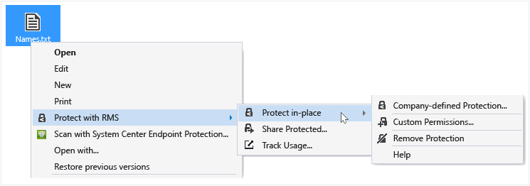

---
# required metadata

title: Change permissions on RMS-protected files - AIP
description: When a file has been protected by Rights Management, you can change the permissions by re-protecting it and then specifying all the users that should have access to it, and what permissions you want to give them.
keywords:
author: cabailey
ms.author: cabailey
manager: mbaldwin
ms.date: 02/23/2017
ms.topic: conceptual
ms.service: information-protection
ms.assetid: 5ac121b3-d7a0-40e4-8fe7-90bf4cf796f1

# optional metadata

#ROBOTS:
#audience:
#ms.devlang:
ms.reviewer: esaggese
ms.suite: ems
#ms.tgt_pltfrm:
#ms.custom:

---

# Change permissions on files that have been protected by Rights Management

>*Applies to: Active Directory Rights Management Services, [Azure Information Protection](https://azure.microsoft.com/pricing/details/information-protection), Windows 10, Windows 7 with SP1, Windows 8, Windows 8.1*

When a file has been protected by Rights Management, you can change the permissions by re-protecting it and then specifying all the users that should have access to it, and what permissions you want to give them.

> [!IMPORTANT]
> This is not an incremental change but a complete replacement. You are effectively re-protecting the file with the complete set of permissions that you want.
> 
>  For example, if a file is protected such that only people in the Marketing department can open it and you want people in the Sales department to also be able to open it, you must re-protect the file so that the Sales department and the Marketing department can open it.
>
> Similarly, if you want to add or remove a permission, you cannot just specify that permission to add or remove but must specify all the permissions that you want the specified people to have.

If you are the owner of the file you want to re-protect (for example, you originally protected it by using the sharing application), you will automatically have permissions to re-protect the file. If are not the owner, you might or might not have permissions to re-protect the file, depending on the permissions that the protected file currently has. You need the [Full Control usage right](../configure-usage-rights.md#usage-rights-and-descriptions) to re-protect a file.

For example, if somebody else protected the file by using the Rights Management sharing application, and they specified a group that you belong to and **Co-Owner** as the custom permission, you will be able to re-protect the file. However, if they didn't specify your name or a group that you belong to, or if they selected **Reviewer - View and Edit**, or a template that does not let you remove permissions, you will not be able to re-protect the file. The easiest way to find out, is to try re-protecting the file.

If you want to completely remove all permissions so that the file is no longer protected, see [Remove protection from a file](sharing-app-remove-protection.md).

## To re-protect a file in-place

1.  In File Explorer, select a file to protect. Right-click, select **Protect with RMS**, and then select **Protect in-place**. For example:

    

    > [!NOTE]
    > If you do not see the **Protect with RMS** option, it’s likely that either the RMS sharing application is not installed on your computer, or your computer must be restarted to complete the installation. For more information about how to install the RMS sharing application, see [Download and install the Rights Management sharing application](install-sharing-app.md).

2.  Do one of the following:

    -   Select a policy template: These are predefined permissions that typically restrict access and usage to people in your organization. For example, if your organization name is "Contoso, Ltd", you might see **Contoso, Ltd - Confidential View Only**. If this is the first time you have protected a file on this computer, you will first need to select **Company-defined Protection** to download the templates.

        The next time you click the **Protect in-place** option, you will see up to 10 templates to choose from. If there are more than 10 templates available and the one you want isn’t displayed, click **Company-defined Protection** to download and see all the templates.

        When you select a policy template, you can also protect multiple files and a folder. When you select a folder, all the files in that folder are automatically selected for protection but new files that you create in that folder will not be automatically protected.

    -   Select **Custom Permissions**: Choose this option if the templates don’t provide the level of protection that you need  or you want to explicitly set the protection options yourself. Specify the options that you want for this file in the [add protection dialog box](sharing-app-dialog-box.md), and then click **Apply**.

3. If you don't have permissions to re-protect the file, you will see an **Unable to protect content** message, with the email address of who to contact (the document owner) so that they can change the permissions for you.

    If you do have permissions to re-protect the file, you might quickly see a dialog box to tell you that the file is being protected, and the focus then returns to File Explorer. The selected file or files are now protected with your changes. 

> [!NOTE]
> Before you can re-protect the file, the Rights Management service must first confirm that you are authorized to do this action for this file, which it does by checking your user name and password. In some cases, this might be cached and you will not see a prompt that asks for your credentials. In other cases, you will be prompted to supply your credentials.
>
> If your organization does not use either Azure Information Protection or AD RMS, you can apply for a free account that will accept your credentials so that you can use RMS-protected files:
>
> -   To apply for this account, click the link to apply for [RMS for individuals](https://go.microsoft.com/fwlink/?LinkId=309469).
>
>     When you sign up, use your company email address rather than a personal email address. If you are signing up because you were emailed a protected attachment, use the same email address that was used to send you the email message.
> -   For more information, see [RMS for individuals and Azure Rights Management](../rms-for-individuals.md).

## To re-protect a file that you have emailed

If you want to change permissions for a file that you have emailed:

- **To let more people read the file**: Email the file to them, following the instructions in [Protect a file that you share by email](sharing-app-protect-by-email.md).

- **To change the permissions for the file**: Email the file again, following the instructions in [Protect a file that you share by email](sharing-app-protect-by-email.md) and choose the new permissions that you want. 

	Because you cannot remove the previous permissions on the originally emailed file, only replace them with a new version, consider revoking the previously emailed file so that the recipients can no longer open that version of the document. Revoking is appropriate if you need to make the permissions more restrictive (for example, remove people who should not have access to the file, or they should no longer be able to edit it).

	To revoke a file that you have emailed, see [Track and revoke your documents](sharing-app-track-revoke.md).

## Examples and other instructions
For examples for how you might use the Rights Management sharing application, and how-to instructions, see the following sections from the Rights Management sharing application user guide:

-   [Examples for using the RMS sharing application](sharing-app-user-guide.md#examples-for-using-the-rms-sharing-application)

-   [What do you want to do?](sharing-app-user-guide.md#what-do-you-want-to-do)

## See Also
[Rights Management sharing application user guide](sharing-app-user-guide.md)
