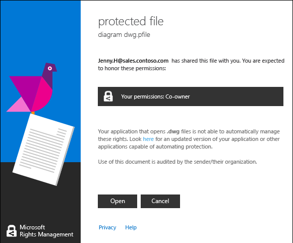

---
# required metadata

title: Open RMS-protected files with the RMS sharing app
description: Instructions to view and use a protected file, which requires you to have the Rights Management (RMS) sharing application installed.
author: cabailey
ms.author: cabailey
manager: mbaldwin
ms.date: 07/18/2017
ms.topic: conceptual
ms.service: information-protection
ms.assetid: e5fa4666-6906-405a-9e0c-2c52d4cd27c8

# optional metadata

#ROBOTS:
#audience:
#ms.devlang:
ms.reviewer: esaggese
ms.suite: ems
#ms.tgt_pltfrm:
#ms.custom:

---

# Use the Rights Management sharing application to view and use protected files

>*Applies to: Active Directory Rights Management Services, [Azure Information Protection](https://azure.microsoft.com/pricing/details/information-protection), Windows 10, Windows 7 with SP1, Windows 8, Windows 8.1*

> [!IMPORTANT]
> **End of support notification**: The Rights Management sharing application for Windows is being replaced by the [Azure Information Protection client](aip-client.md). Support for this older application will stop January 31, 2019.

When the [Rights Management (RMS) sharing application is installed on your computer](install-sharing-app.md), you can view a protected file by simply double-clicking it. The file might be an attachment in an email message, or you might see it when you use File Explorer.

Before you can view the protected file, the Rights Management service must first confirm that you are authorized to view the file, which it does by checking your user name and password. In some cases, this might be cached and you will not see a prompt that asks for your credentials. In other cases, you will be prompted to supply your credentials.

If your organization does not use either Azure Information Protection or AD RMS, you can apply for a free account that will accept your credentials so that you can open files that are protected by using RMS:

- To apply for this account, click the link to apply for [RMS for individuals](https://go.microsoft.com/fwlink/?LinkId=309469). 
    
    When you sign up, use your company email address rather than a personal email address. If you are signing up because you were emailed a protected attachment, use the same email address that was used to send you the email message.

- For more information, see [RMS for individuals and Azure Rights Management](../rms-for-individuals.md).

## To view a protected file
By using File Explorer or the email message that contains the attachment, double-click the protected file, and enter your credentials if prompted to do so.

If you see two versions of the file but with different file name extensions, open the file that has a .ppdf file extension only if the other file does not open. If you cannot open the .ppdf version either, first install the [RMS sharing application](install-sharing-app.md), which knows how to open files that have a .ppdf file name extension.

> [!NOTE]
> For more information, see [What’s the .ppdf file that’s automatically created?](sharing-app-dialog-box.md#whats-the-ppdf-file-thats-automatically-created)

How the file opens depends on how it was protected, which you can tell by looking at the file name extension. In each case, opening the file might be audited and remains audited as long as it is protected. In addition, if the file was sent as an email attachment, the sender might be notified by email each time you open the file.

- **The file has a *.pfile* file name extension**

    The file was generically protected.

    When you open the file, you see a **protected file** dialog box from the sharing application that tells you who protected the file and that you are expected to honor the co-owner permissions. Click **Open** to read the file.

    

- **The file has a *.ppdf* file name extension or is a protected text or image file (such as *.ptxt* or *.pjpg*)**

    The file has been natively protected as a read-only copy.

    The file opens by using the viewer that installs with the RMS sharing application. This file is read-only, even if you save it to another location or rename it.

- **Other file name extensions**

    The file has been natively protected.

    The file opens by using the application that is associated with the original file name extension, and a restriction banner is displayed at the top of the file. The banner might display the permissions that are applied to the file, or it might provide a link to display them. For example, you might see the following where you must click **Permission is currently restricted** to see the actual permissions that are applied to the file and the people that can access it:

    

For a complete list of file name extensions that the Rights Management services support, see the [Supported file types and file name extensions](sharing-app-admin-guide-technical.md#supported-file-types-and-file-name-extensions) sections in the [Rights Management sharing application administrator guide](sharing-app-admin-guide.md). If your file name extension is not listed, use a web search to see if it is a file name extension that is supported by another application.

## To use files that have been protected (for example, edit and print the file)
If, after opening the protected file, you want to do more than just read it (for example, edit, copy, and print it), follow the instructions according to the file name extension:

- **The file has a *.pfile* file name extension**

    Save the opened file and give it a new file name extension that is associated with the application that you want to use.

    For example, if a file was protected by using the file name document.vsdx.pfile, view the file and in File Explorer, save the file as document.vsdx.

    The new file is no longer protected. If you want to protect it, you must do this manually. For instructions, see [Protect a file on a device (protect in-place) by using the Rights Management sharing application](sharing-app-protect-in-place.md).

- **The file has a *.ppdf* file name extension or is a protected text or image file (such as *.ptxt* or *.pjpg*)**

    You can only view the file and if you rename or move it, the protection remains with the file.

- **Other file name extensions**

    Your device must have an application that understands Rights Management protection to use these files. These applications are called RMS-enlightened applications. Applications from Office 2016, Office 2013, and Office 2010 (such as Word, Excel, PowerPoint, and Outlook) are examples of applications that are enlightened for Rights Management. But applications that do not come from Microsoft, such as other software companies and your own line-of-business applications, might also be enlightened for Rights Management.

    Applications that are enlightened for Rights Management know how to open files that have been protected by other Rights Management enlightened applications. They also persist the protection that is applied to them, even if you edit the file or save it to another file name or another location. These applications let you use the file according to the permissions that are currently applied to the file, so that if you have permissions to use the file, you can do so. For example, you might be able to edit the file but not print it.

## Examples and other instructions
For examples for how you might use the Rights Management sharing application, and how-to instructions, see the following sections from the Rights Management sharing application user guide:

-   [Examples for using the RMS sharing application](sharing-app-user-guide.md#examples-for-using-the-rms-sharing-application)

-   [What do you want to do?](sharing-app-user-guide.md#what-do-you-want-to-do)

## See Also
[Rights Management sharing application user guide](sharing-app-user-guide.md)
