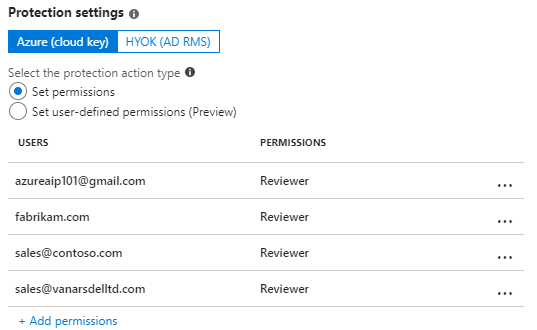
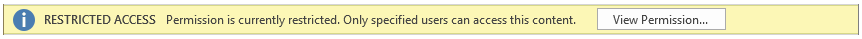
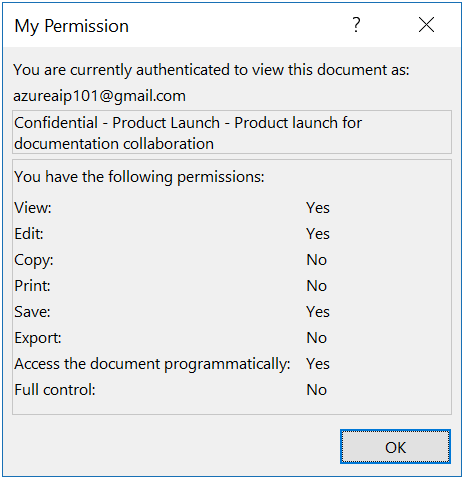
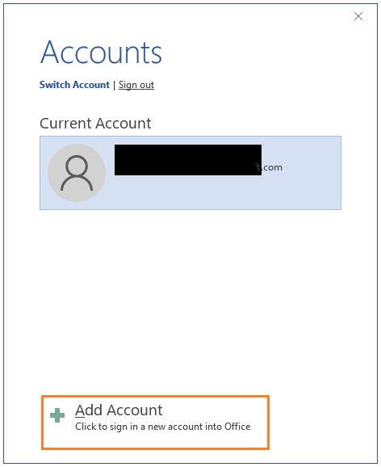
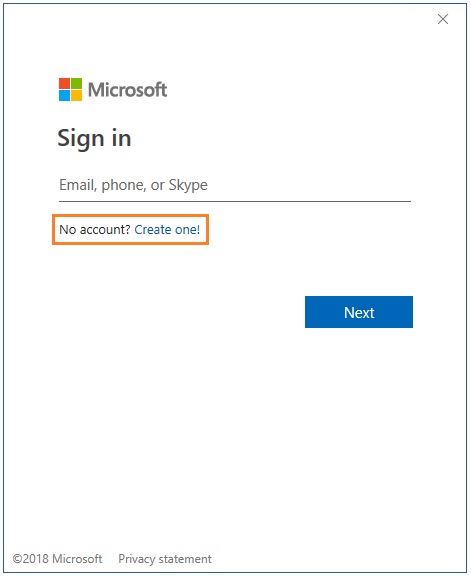

---
# required metadata

title: Configuring secure document collaboration with Azure Information Protection
description: End-to-end workflow for collaborating on documents that are protected by Azure Information Protection.
author: cabailey
ms.author: cabailey
manager: mbaldwin
ms.date: 06/21/2018
ms.topic: conceptual
ms.service: information-protection
ms.assetid: 4895c429-959f-47c7-9007-b8f032f6df6f

# optional metadata

#ROBOTS:
#audience:
#ms.devlang:
ms.reviewer: esaggese
ms.suite: ems
#ms.tgt_pltfrm:
#ms.custom:

---

# Configuring secure document collaboration by using Azure Information Protection

>*Applies to: [Azure Information Protection](https://azure.microsoft.com/pricing/details/information-protection), [Office 365](http://download.microsoft.com/download/E/C/F/ECF42E71-4EC0-48FF-AA00-577AC14D5B5C/Azure_Information_Protection_licensing_datasheet_EN-US.pdf)*

When you use Azure Information Protection, you can protect your documents without sacrificing collaboration for authorized users. The majority of documents that one user creates and then shares with others to view and edit will be Office documents from Word, Excel, and PowerPoint. These documents support native protection, which means that in addition to the protection features of authorization and encryption, they also support restricted permission for more fine-grained control. 

These permissions are called usage rights, and include permissions such as view, edit, print. You can define individual usage rights when a document is protected, or you can define a grouping of usage rights, called permission levels. Permission levels make it easier to select usage rights that are typically used together, for example, Reviewer and Co-Author. For more information about usage rights and permission levels, see [Configuring usage rights for Azure Information Protection](configure-usage-rights.md).

When you configure these permissions, you can specify which users they are for:

- **For users in your own organization or another organization that uses Azure Active Directory**: You can specify Azure AD user accounts, Azure AD groups, or all users in that organization. 

- **For users who do not have an Azure Active Directory account**: Specify an email address that will be used with a Microsoft account. This account can already exist, or users can create it at the time they open the protected document. 
    
    To open documents with a Microsoft account, users must use Office 2016 Click-to-Run. Other Office editions and versions do not yet support opening Office protected documents with a Microsoft account.

- **For any authenticated user**: This option is suitable for when you don't need to control who accesses the protected document, providing the user can be authenticated. The authentication can be by Azure AD, by using a Microsoft account, or even a federated social provider or one-time passcode when the content is protected by the new capabilities of Office 365 Message Encryption. 

As an administrator, you can configure an Azure Information Protection label to apply the permissions and authorized users. This configuration makes it very easy for users and other administrators to apply the correct protection settings, because they simply apply the label without having to specify any details. The following sections provide an example walkthrough to protect a document that supports secure collaboration with internal and external users.

## Example configuration for a label to apply protection to support internal and external collaboration

This example walks through configuring an existing label to apply protection so that users from your organization can collaborate on documents with all users from another organization that has Office 365 or Azure AD, a group from a different organization that has Office 365 or Azure AD, and a user who doesn't have an account in Azure AD and instead will use their Gmail email address.

Because the scenario restricts access to specific people, it does not include the setting for any authenticated users. For an example of how you can configure a label with this setting, see [Example 5: Label that encrypts content but doesn't restrict who can access it](configure-policy-protection.md#example-5-label-that-encrypts-content-but-doesnt-restrict-who-can-access-it).  

1. Select your label that's already in the global policy or a scoped policy. On the **Protection** blade, make sure **Azure (cloud key)** is selected.
    
2. Make sure **Set permissions** is selected, and select **Add permissions**.

3. On the **Add permissions** blade: 
    
    - For your internal group: Select **Browse directory** to select the group, which must be email-enabled.
    
    - For all users in the first external organization: Select **Enter details** and type the name of a domain in the organization's tenant. For example, fabrikam.com.
    
    - For the group in the second external organization: Still on the **Enter details** tab, type the email address of the group in the organization's tenant. For example, sales@contoso.com.
    
    - For the user who doesn't have an Azure AD account: Still on the **Enter details** tab, type the user's email address. For example, bengi.turan@gmail.com. 

4. To grant the same permissions to all these users: For **Choose permissions from preset**, select **Co-Owner**, **Co-Author**, **Reviewer**, or **Custom** to select the permissions that you want to grant.
    
    For example, your configured permissions might look similar to the following:
        
    

5. Click **OK** on the **Add permissions** blade.

6. On the **Protection** blade, click **OK**.

7. On the **Label** blade, select **Save**. 

## Applying the label that supports secure collaboration

Now that this label is configured, it can be applied to documents in a number of ways that include the following:

|Different ways to apply the label|More information|
|---------------|----------|
|A user manually selects the label when the document is created in their Office application.|Users select the label from the **Protect** button on the Office ribbon, or from the Azure Information Protection bar.|
|Users are prompted to select a label when a new document is saved.|You've configured the Azure Information Protection [policy setting](configure-policy-settings.md) named **All documents and emails must have a label**.|
|A user shares the document by email and manually selects the label in Outlook.|Users select the label from the **Protect** button on the Office ribbon, or from the Azure Information Protection bar, and the attached document is automatically protected with the same settings.|
|An administrator applies the label to the document by using PowerShell.|Use the [Set-AIPFile​Label](/powershell/module/azureinformationprotection/set-aipfilelabel) cmdlet to apply the label to a specific document or all documents in a folder.|
|You have additionally configured the label to apply automatic classification that can now be applied by using the Azure Information Protection scanner, or PowerShell.|See [How to configure conditions for automatic and recommended classification for Azure Information Protection](configure-policy-classification.md).|

To complete this walkthrough, manually apply the label when you create the document in your Office application: 

1. On a client computer, if you already have your Office application open, first close and reopen it to get the latest policy changes that include your newly configured label. 

2. Apply the label to a document, and save it.

Share the protected document by attaching it to an email, and send it to the people you authorized to edit the document.

## Opening and editing the protected document

When users that you authorized open the document for editing, the document opens with an information banner that informs them that permissions are restricted. For example:

If they select the **View Permission** button, they see the permissions that they have. In the following example, the user can view and edit the document:

Note: If the document is opened by external users who are also using Azure Information Protection, the Office application does not display your classification label for the document, although any visual markings from the label remain. Instead, external users can apply their own label in line with their organization's classification taxonomy. If these external users then send back the edited document to you, Office displays your original classification label when you reopen the document.

Before the protected document opens, one of the following authentication flows happen:

- For the users who have an Azure AD account, they use their Azure AD credentials to be authenticated by Azure AD, and the document opens. 

- For the user who doesn't have an Azure AD account, if they are not signed in to Office with an account that has permissions to open the document, they see the **Accounts** page. 
    
   On the **Accounts** page, select **Add Account**:
   
    

   On the **Sign in** page, select **Create one!** and follow the prompts to create a new Microsoft account with the email address that was used to grant the permissions:
    
    
    
    When the new Microsoft account is created, the local account switches to this new Microsoft account and the user can then open the document.

### Supported scenarios for opening protected documents

The following table summaries the different authentication methods that are supported for viewing and editing protected documents.

In addition, the following scenarios support viewing documents:

- The Azure Information Protection viewer for Windows, and for iOS and Android can open files by using a Microsoft account. 

- A browser can open protected attachments when social providers and one-time passcodes are used for authentication with Exchange Online and the new capabilities from Office 365 Message Encryption. 

|Platforms for viewing and editing documents:  Word, Excel, PowerPoint|Authentication method: Azure AD|Authentication method: Microsoft account|
|---------------|----------|-----------|-----------|
|Windows|Yes [[1]](#footnote-1)|Yes [[2]](#footnote-2)|
|iOS|Yes [[1]](#footnote-1)|No|
|Android|Yes [[1]](#footnote-1)|No|
|MacOS|Yes [[1]](#footnote-1)|No|

###### Footnote 1
Supports user accounts, email-enabled groups, all members. User accounts and email-enabled groups can include guest accounts. All members exclude guest accounts.

###### Footnote 2
Currently supported by Office 2016 Click-to-Run only.

## Next steps

See other [example configurations](configure-policy-protection.md#example-configurations) for labels to apply protection for common scenarios. This article also contains more details about the protection settings.

For more information about the other options and settings that you can configure for your label, see [Configuring Azure Information Protection policy](configure-policy.md). 

The label that was configured in this article also creates a protection template by the same name. If you have applications and services that integrate with protection templates from Azure Information Protection, they can apply this template. For example, DLP solutions and mail flow rules. Outlook on the web automatically displays protection templates from the Azure Information Protection global policy. 

