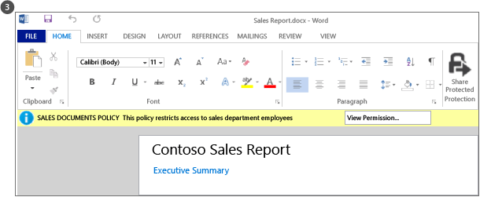

---
# required metadata

title: What admins and users see with  Azure RMS - AIP
description: See some typical examples of how administrators and users see and can use Azure Rights Management (Azure RMS) technology to help protect sensitive or confidential information.
author: cabailey
ms.author: cabailey
manager: mbaldwin
ms.date: 03/06/2017
ms.topic: article
ms.prod:
ms.service: information-protection
ms.technology: techgroup-identity
ms.assetid: 013e0eb4-49a7-4e81-9e4d-f56c0ceb017f

# optional metadata

#ROBOTS:
#audience:
#ms.devlang:
ms.reviewer: esaggese
ms.suite: ems
#ms.tgt_pltfrm:
#ms.custom:

---

# Azure RMS in action: What administrators and users see

>*Applies to: Azure Information Protection, Office 365*

This article shows some typical examples of how administrators and users see and can use Azure Rights Management (Azure RMS) to help protect sensitive or confidential information.

> [!NOTE]
> In all these examples where Azure RMS protects data, the content owner continues to have full access to the data (file or email), even if the applied protection grants permissions to a group that the owner wasn’t a member of, or even if the applied protection includes an expiration date.
>
> Similarly, IT can always access the protected data without restrictions, by using the super user feature of Rights Management that grants delegated access to authorized users or services that you specify. In addition, IT can track and monitor usage for data that has been protected—for example, who is accessing the data and when.

For other screenshots and videos that show RMS in action, check the [Enterprise Mobility and Security Blog](https://blogs.technet.microsoft.com/enterprisemobility/?product=azure-rights-management-services).

## Activating and configuring Rights Management
Although you can use Windows PowerShell to activate and configure Azure RMS, it’s easiest from the management portal. As soon as the service is activated, you have two default templates that administrators and users can select to quickly and easily apply information protection to files. But you can also create your own custom templates for additional options and settings.

**WHAT ADMINS SEE IN STEP 1:** You can use either the Office 365 admin center (first picture) or the Azure classic portal (second picture) to activate RMS.  Just one click to activate and another click to confirm, then information protection is enabled for administrators and users in your organization.

---

**WHAT ADMINS SEE IN STEP 2:** After activation, two rights policy templates are automatically available for your organization. One template is for read-only (**Confidential View Only** is included in the name), the other for read and modify access (**Confidential**).

When these templates are applied to files or emails, they restrict access to users in your organization. This is a very quick and easy way to help prevent your company data leaking to people outside your organization.

> [!TIP]
> You can easily recognize these default templates, because they are automatically prefixed by your organization name. In our example, **VanArsdel, Ltd**

If you do not want users to see these templates or if you want to create your own templates, you can do this from the Azure classic portal. As this picture shows, a wizard takes you through the custom template creation process.

---

**WHAT ADMINS SEE IN STEP 3:** Offline access, expiration settings, and whether to publish the template immediately (make it visible in applications that support Rights Management) are some of the configuration settings available if you decide to create your own templates.

---

**WHAT USERS SEE IN STEP 4:** As a result of publishing these templates, users can now select them in applications such as  File Explorer and Microsoft Word:

- A user could choose the default template, **VanArsdel, Ltd – Confidential**. Then, only employees from the VanArsdel organization can open and use this document, even if it’s later emailed to somebody outside the organization or saved to a public location.

- A user could choose the custom template that the administrator created, **Sales and Marketing – Read and Print Only**. Then, not only is the file protected from people outside the organization, but it’s also restricted to employees from the Sales and Marketing department. Further, these employees do not have full rights to the document, only read and print. For example, they cannot modify it or copy from it.

---

**More information for this scenario:**

- For step-by-step instructions, see [Activating Azure Rights Management](../deploy-use/activate-service.md) and [Configuring custom templates for the Azure Rights Management service](../deploy-use/configure-custom-templates.md).

- To help users protect important company files, see [Helping users to protect files by using the Azure Rights Management service](../deploy-use/help-users.md).

Next, see some examples of how administrators can apply the templates to automatically configure information protection for files and emails.

## Automatically protecting files on file servers running Windows Server and File Classification Infrastructure

This example shows how you can use Azure RMS to automatically protect files on file servers that run at least Windows Server 2012 and are configured to use File Classification Infrastructure.

There are many ways to apply classification values to files. For example, you can inspect the contents of files and accordingly apply built-in classifications such as Confidentiality and Personally Identifiable Information. However, in this example, an administrator creates a custom classification of **Marketing** that is automatically applied to all user documents that are saved in the **Marketing Promotions** folder. Although this folder is protected with NTFS permissions that restricts access to members of the Marketing group, the administrator knows that these permissions can be lost if somebody from that group moves or emails the files. Then, the information in the files could be accessed by unauthorized users.

**WHAT ADMINS SEE IN STEP 1:** The administrators installs and configures the Rights Management (RMS) connector, which acts as a relay between on-premises servers and Azure RMS.

---

**WHAT ADMINS SEE IN STEP 2:** On the file server, the administrator configures the classification rules and tasks so that all user files in the **Marketing Promotions** folder are automatically classified as **Marketing** and protected with RMS encryption.

She selects the custom RMS template that was created in our first example, which restricts access to members of the Sales and Marketing departments: **Sales and Marketing – Read and Print Only**.

As a result, all documents in that folder are automatically configured with the Marketing classification and protected by the Sales and Marketing RMS template.

---

**WHAT USERS SEE IN STEP 3:** How RMS helps to prevent data leaking to people who should not have access to sensitive or confidential information:

- Janet, from Marketing, emails a confidential report from the Marketing Promotions folder. This report contains new product features and advertising plans and is requested by a co-worker who is currently traveling on business. However, Janet mistakenly emails it to the wrong person—she didn’t notice that she accidentally selected a recipient with a similar name, in another company.  
The recipient cannot read the confidential report because he is not a member of the Sales and Marketing group.

---

**More information for this scenario:**

- For step-by-step instructions, see [Deploying the Azure Rights Management connector](../deploy-use/deploy-rms-connector.md).

## Automatically protecting emails with Exchange Online and data loss prevention policies

The previous example showed how you could automatically protect files that contain sensitive or confidential information, but what if the information is not in a file, but in an email message? This is where Exchange Online data loss prevention (DLP) policies comes in, either prompting users to apply information protection (by using Policy Tips) or automatically applying it for them (by using transport rules).

In this example, the administrator configures a policy to help keep the organization in compliance with US regulations for protecting personally identifiable information data, but rules can also be configured for other compliance regulations, or custom rules that you define.

**WHAT ADMINS SEE IN STEP 1:** In the Exchange admin center, the Exchange template named **U.S. Personally Identifiable Information (PII) Data** is used by the administrator to create and configure a new DLP policy. This template looks for information such as social security numbers and driver license numbers in email messages.

The rules are configured so that email messages that contain this information and that are sent outside the organization automatically have rights protection applied by using an RMS template that restricts access to company employees only.

Here, the rule is configured to use one of the default templates, **VanArsdel, Ltd – Confidential**, from our first example. But you can also see how the choice of templates includes any custom templates you’ve created, and a **Do Not Forward** option that is specific to Exchange.

> [!NOTE]
> If the configuration options you see are slightly different from the picture, you might need to first select  **More options** when you configure the rule. You can then select **Modify the message security** > **Apply rights protection**, and then select the RMS template.

---

**WHAT USERS SEE IN STEP 2:** The hiring manager writes an email message that contains the social security number of a recently hired employee. He sends this email message to Sherrie in the Human Resources department.

---

**WHAT USERS SEE IN STEP 3:** If this email message is sent or forwarded to somebody outside the organization, the DLP rule automatically applies rights protection.

The email is encrypted when it leaves the organization’s infrastructure, so that the social security number in the email message cannot be read while in transit, or in the recipient’s inbox. The recipient will not be able to read the message unless he or she is a VanArsdel employee.

---

**More information for this scenario:**

-   For more information about how Azure RMS works with Exchange Online, see [Exchange Online and Exchange Server](office-apps-services-support.md#exchange-online-and-exchange-server) section from [How applications support the Azure Rights Management service](applications-support.md).

-   For step-by-step instructions to configure Exchange Online for Azure RMS, see the [Exchange Online: IRM Configuration](../deploy-use/configure-office365.md#exchange-online-irm-configuration) from [Configuring applications for Azure Rights Management](../deploy-use/configure-applications.md).

## Automatically protecting files with SharePoint Online and protected libraries

This shows how you can easily protect documents when you use SharePoint Online and protected libraries.

In this example, the SharePoint administrator for Contoso has created a library for each department that they use to centrally store and check out documents for editing and version control. For example, there is a library for Sales, one for Marketing, one for Human Resources, and so on. When a new document is uploaded or created in one of these protected libraries, that document inherits the protection of the library (no need to select a rights policy template) and that document is automatically protected and remains protected, even if it’s moved outside the SharePoint library.

**WHAT ADMINS SEE IN STEP 1:** The administrator enables Information Rights Management for the SharePoint site.

---

**WHAT ADMINS SEE IN STEP 2:** Then, she enables Rights Management for a library. Although there are additional options, this simple setting is often all that’s needed.

When documents are now downloaded from this library, they  are automatically protected by Rights Management, inheriting the protection that’s configured for the library.

---

**WHAT USERS SEE IN STEP 3:** When somebody from the sales department checks out this sales report from the library, they can clearly see from the information banner at the top that it’s a protected document with restricted access.

The document remains protected even if the user renames it, saves it to another location, or shares it by email. No matter what the file is named, where it’s stored, or whether it’s shared by email, only members of the sales department can read it.

---

**More information for this scenario:**

-   For more information how Azure RMS works with SharePoint, see the [SharePoint Online and SharePoint Server](office-apps-services-support.md#sharepoint-online-and-sharepoint-server) section from [How applications support the Azure Rights Management service](applications-support.md).

-   For step-by-step instructions to configure SharePoint for Azure RMS, see the [SharePoint Online and OneDrive for Business: IRM Configuration](../deploy-use/configure-office365.md#sharepoint-online-and-onedrive-for-business-irm-configuration) section from [Configuring Applications for Azure Rights Management](../deploy-use/configure-applications.md).

## Users safely share attachments with mobile users

The previous examples showed how administrators can automatically apply information protection to sensitive and confidential data. But there will be some occasions when users might need to apply this protection themselves. For example, they are collaborating with partners in another organization, they need custom permissions or settings that are not defined in templates, for or ad-hoc situations that are not covered by the previous examples. In these situations, users can apply the RMS templates themselves or configure custom permissions.

This example shows how users can easily share a document with somebody they’re collaborating with from another company, but are still able to protect the document and are confident that the recipient can read it, even from a popular mobile device. This scenario uses the Rights Management sharing application, which you can automatically deploy to Windows computers in your organization. Or, users can install it themselves.

In this example, Alice from Contoso, emails a confidential Word document that she sends to Bob, at Fabrikam. He reads the document on his iPad, but he could just as easily read it on an iPhone, an Android tablet or phone, a Mac computer, or a Windows phone or computer.

**WHAT USERS SEE IN STEP 1:** From her Windows PC, Alice creates a standard email message and attaches a document.

She clicks **Share Protected** on the ribbon, which loads the **share protected** dialog box from the RMS sharing application.

Alice wants to restrict Bob to viewing and editing the document, and doesn’t want him to copy or print it, so she selects **REVIEWER – View and Edit**. She also wants to be emailed when somebody tries to open the document, and have the ability to revoke the document later if necessary and know that revocation will take effect immediately.

---

**WHAT USERS SEE IN STEP 2:** Bob sees the email on his iPad.

In addition to Alice’s message and attachment, there are instructions that he follows to sign up and install the RMS sharing app on his iPad.

---

**WHAT USERS SEE IN STEP 3:** Bob can now open the attachment. He is first asked to sign in to confirm that he is the intended recipient.

When Bob views the document, he also sees the restricted access information that tells him he can view and edit the document, but not copy or print.

---

**WHAT USERS SEE IN STEP 4:** Alice receives an email message that tells her Bob successfully opened the document that she sent, and when he accessed the document.

If Bob forwards his email with the attachment, or saves it where others can access it, or it is intercepted on the network, other people will not be able to read the document.

---

**More information for this scenario:**

- For step-by-step instructions, see [Protect a file that you share by email](../rms-client/sharing-app-protect-by-email.md) and [View and use files that have been protected](../rms-client/sharing-app-view-use-files.md) from the [Rights Management sharing application user guide](../rms-client/sharing-app-user-guide.md).

- The [Quick start tutorial for Azure Rights Management](../get-started/quick-start-tutorial.md) includes step-by-step instructions for this scenario.

## Next steps

Now you’ve seen some examples of what Azure RMS can do, you might be interested in how it does it. For technical information about how Azure RMS works, see [How does Azure RMS work?](how-does-it-work.md)

[!INCLUDE[Commenting house rules](../includes/houserules.md)]