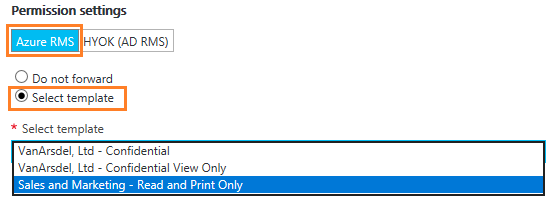

---
# required metadata

title: What is Azure Information Protection?
description: An overview of the Azure Information Protection service.
author: cabailey
ms.author: cabailey
manager: mbaldwin
ms.date: 10/03/2017
ms.topic: article
ms.prod:
ms.service: information-protection
ms.technology: techgroup-identity
ms.assetid: cd8a88e2-3555-4be2-9637-3cdee992f2c8

# optional metadata

#ROBOTS:
#audience:
#ms.devlang:
#ms.reviewer: eymanor
#ms.suite: ems
#ms.tgt_pltfrm:
#ms.custom:

---

# What is Azure Information Protection?

>*Applies to: Azure Information Protection*

Azure Information Protection is a cloud-based solution that helps an organization to classify, label, and protect its documents and emails. This can be done automatically by administrators who define rules and conditions, manually by users, or a combination where users are given recommendations. 

The following picture shows an example of Azure Information Protection in action. The administrator has configured rules to detect sensitive data (in this case, credit card information). When a user saves a Word document that contains credit card information, she sees a custom tooltip that recommends she applies a specific label that the administrator configured. This label classifies and optionally, depending on the configuration, protects the document. 

After your content is classified (and optionally protected), you can then track and control how it is used. You can analyze data flows to gain insight into your business, detect risky behaviors and take corrective measures, track access to documents, prevent data leakage or misuse, and so on.

## How labels apply classification

You use Azure Information Protection labels to apply classification to documents and emails. When you do this, the classification is identifiable at all times, regardless of where the data is stored or with whom it’s shared. The labels include visual markings such as a header, footer, or watermark. Metadata is added to files and email headers in clear text. The clear text ensures that other services, such as data loss prevention solutions, can identify the classification and take appropriate action. 

For example, the following email message has been classified as "General". This label is added as a footer to the email message. This footer is a visual indicator for all recipients that it's intended for general business data that should not be sent outside the organization. The label is also embedded in the email headers so that email services can inspect this value and could create an audit entry or prevent it from being sent outside the organization.

## How data is protected

The protection technology uses *Azure Rights Management* (often abbreviated to Azure RMS). This technology is integrated with other Microsoft cloud services and applications, such as Office 365 and Azure Active Directory. It can also be used with your own line-of-business applications and information protection solutions from software vendors, whether these applications and solutions are on-premises, or in the cloud.

This protection technology uses encryption, identity, and authorization policies. Similarly to the labels that are applied, protection that is applied by using Rights Management stays with the documents and emails, independently of the location—inside or outside your organization, networks, file servers, and applications. This information protection solution keeps you in control of your data, even when it is shared with other people.

For example, you can configure a report document or sales forecast spreadsheet so that it can be accessed only by people in your organization, and control whether that document can be edited, or restricted to read-only, or prevent it from being printed. You can configure emails similarly, and also prevent them from being forwarded or prevent the use of the Reply All option. These protection tasks can be simplified and streamlined by using *Rights Management templates*.

### Rights Management templates

As soon as you activate the Azure Rights Management service, two default templates are available for you that restricts data access to users within your organization. You can use these templates to immediately help prevent data leaking from your organization. You can also supplement these default templates by configuring your own protection settings that apply more restrictive controls.

Templates can be part of a label's configuration. When that label is applied to a document or email message, the data is both classified and automatically protected. The templates can also be selected by users or administrators in products and services that support the Azure Rights Management technology.

This example shows how you might select a template for a label when you configure the Azure Information Protection policy from the Azure portal:

The same templates can be selected from the Exchange admin center. For example, you can configure Exchange Online mail flow rules to use these templates because Exchange supports the Azure Rights Management technology:

For more information about the Azure Rights Management protection, see [What is Azure Rights Management?](what-is-azure-rms.md)

## Integration with end-user workflows

Azure Information Protection integrates with end users' existing workflows when the Azure Information Protection client is installed. This client installs the Information Protection bar to Office applications, which we saw in the first picture that showed this bar in Word. The same Information Protection bar is added to Excel, PowerPoint, and Outlook. For example:

This Information Protection bar makes it easy for end users to select labels for the correct classification. If required, labels can also be applied automatically to remove the guesswork for users, or to comply with your organization's policies.

To classify and protect additional file types, and to support multiple files at once, users can right-click files or a folder from Windows File Explorer:

When users select the **Classify and protect** menu option from File Explorer, they can then select a label similarly to how they use the Information Protection bar in their Office desktop apps. They can also set their own custom permissions, if required.

Power users (and administrators) might find using PowerShell commands more efficient for managing and setting classification and protection for multiple files. The PowerShell commands to do this are automatically included with the client, although you can also install the PowerShell module separately.

After a document has been protected, users and administrators can use a document tracking site to monitor who is accessing these documents and when. If they suspect misuse, they can also revoke access to these documents:

## Resources for Azure Information Protection

- Free trial: [Enterprise Mobility + Security E5](https://portal.office.com/Signup/Signup.aspx?OfferId=87dd2714-d452-48a0-a809-d2f58c4f68b7)

- Download the client: [Azure Information Protection client](https://www.microsoft.com/en-us/download/details.aspx?id=53018)

- Download a customizable user guide: [Azure Information Protection End User Adoption Guide](https://download.microsoft.com/download/7/1/2/712A280C-1C66-4EF9-8DC3-88EE43BEA3D4/Azure_Information_Protection_End_User_Adoption_Guide_EN_US.pdf)

- FAQs: [Frequently asked questions for Azure Information Protection](../get-started/faqs.md)

- Yammer: [Azure Information Protection](https://www.yammer.com/askipteam/#/threads/inGroup?type=in_group&feedId=8652489&view=all)

In addition, **Microsoft Ignite 2017** has many sessions for Azure Information Protection that are available on demand. For a summary of announcements that were made at this conference, see [What’s new in Azure Information Protection @ Ignite 2017](https://blogs.technet.microsoft.com/enterprisemobility/2017/09/27/whats-new-in-azure-information-protection-ignite-2017/). 

You can [search and find](https://myignite.microsoft.com/videos?q=%2522azure%2520information%2520protection%2522) the sessions that are tagged for Azure Information Protection on the Ignite website. However, we recommend that you start with the following sessions:

- [Protecting complete data lifecycle using Microsoft information protection capabilities](https://myignite.microsoft.com/videos/55397)

- [Accelerate Azure information protection deployment and adoption](https://myignite.microsoft.com/videos/53454)

- [Discover what’s new in Azure Information Protection and learn about the roadmap and strategy](https://myignite.microsoft.com/videos/53453)

- [Encryption key management strategies for compliance](https://myignite.microsoft.com/videos/53455)

- [Protect and control your sensitive emails with new Office 365 Message Encryption capabilities](https://myignite.microsoft.com/videos/53230)

## Next steps

Read the blog post, [Azure Information Protection: Ready, set, protect!](https://blogs.technet.microsoft.com/enterprisemobility/2017/02/21/azure-information-protection-ready-set-protect/)

Configure and see Azure Information Protection for yourself, with our 5-step [Quick start tutorial for Azure Information Protection](../get-started/infoprotect-quick-start-tutorial.md).

Perhaps you know Azure Information Protection or Azure Rights Management by another name? See [our list of alternative terms for the service](azure-rms-aka.md).

[!INCLUDE[Commenting house rules](../includes/houserules.md)]