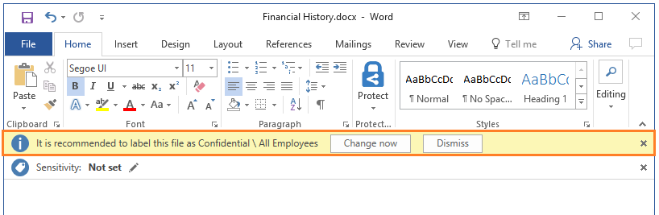
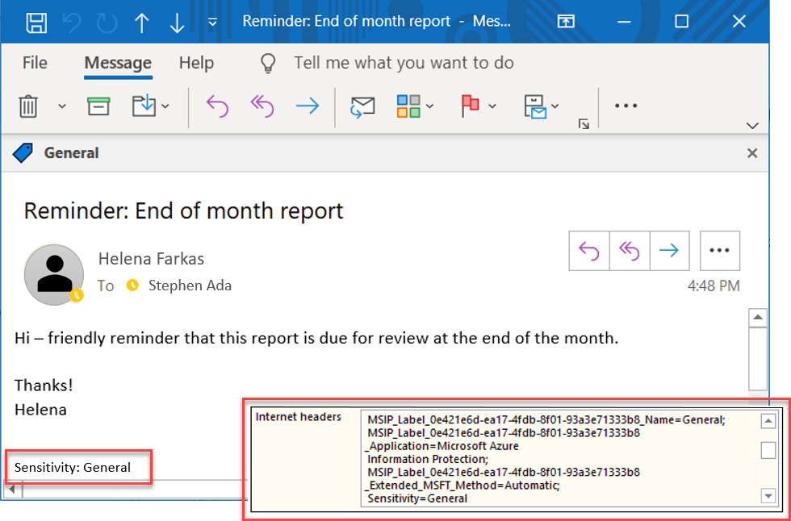
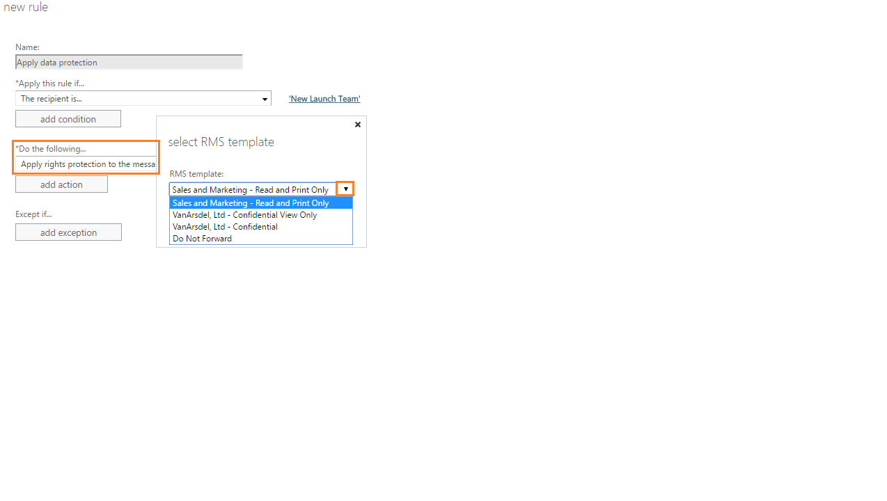
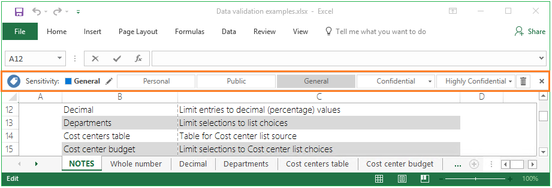
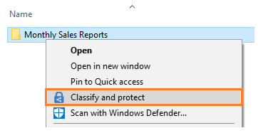
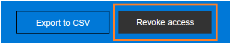
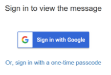
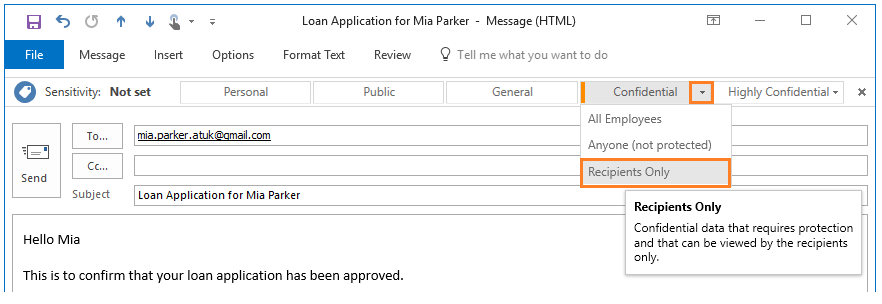

---
# required metadata

title: What is Azure Information Protection? - AIP
description: An technical overview of the Azure Information Protection service, which helps an organization label documents and emails to classify and protect its data, wherever it resides.
author: cabailey
ms.author: cabailey
manager: barbkess
ms.date: 04/17/2019
ms.topic: overview
ms.collection: M365-security-compliance
ms.service: information-protection
Customer intent: As an administrator, I want to label documents and emails to classify and protect my organization's data, wherever it resides.

# optional metadata

#ROBOTS:
#audience:
#ms.devlang:
#ms.reviewer: eymanor
#ms.suite: ems
#ms.tgt_pltfrm:
#ms.custom:

---

# What is Azure Information Protection?

>*Applies to: [Azure Information Protection](https://azure.microsoft.com/pricing/details/information-protection)*

Azure Information Protection (sometimes referred to as AIP) is a cloud-based solution that helps an organization to classify and optionally, protect its documents and emails by applying labels. Labels can be applied automatically by administrators who define rules and conditions, manually by users, or a combination where users are given recommendations. 

The following picture shows an example of Azure Information Protection in action on a user's computer. The administrator has configured a label with rules that detect sensitive data and in our example, this is credit card information. When a user saves a Word document that contains a credit card number, she sees a custom tooltip that recommends the label that the administrator has configured. This label classifies the document and protects it. 

After your content is classified (and optionally protected), you can then track and control how it is used. You can analyze data flows to gain insight into your business, detect risky behaviors and take corrective measures, track access to documents, prevent data leakage or misuse, and so on.

## How labels apply classification

You use Azure Information Protection labels to apply classification to documents and emails. When you do this, the classification is identifiable regardless of where the data is stored or with whom it’s shared. The labels can include visual markings such as a header, footer, or watermark. Metadata is added to files and email headers in clear text. The clear text ensures that other services, such as data loss prevention solutions, can identify the classification and take appropriate action. 

For example, the following email message has been classified as "General". The label has added a footer of "Sensitivity: General" to the email message. This footer is a visual indicator for all recipients that it's intended for general business data that should not be sent outside the organization. The label is embedded in the email headers so that email services can inspect this value and could create an audit entry or prevent it from being sent outside the organization.

## How data is protected

The protection technology uses *Azure Rights Management* (often abbreviated to Azure RMS). This technology is integrated with other Microsoft cloud services and applications, such as Office 365 and Azure Active Directory. It can also be used with your own line-of-business applications and information protection solutions from software vendors, whether these applications and solutions are on-premises, or in the cloud.

This protection technology uses encryption, identity, and authorization policies. Similarly to the labels that are applied, protection that is applied by using Rights Management stays with the documents and emails, independently of the location—inside or outside your organization, networks, file servers, and applications. This information protection solution keeps you in control of your data, even when it is shared with other people.

For example, you can configure a report document or sales forecast spreadsheet so that it can be accessed only by people in your organization, and control whether that document can be edited, or restricted to read-only, or prevent it from being printed. You can configure emails similarly, and also prevent them from being forwarded or prevent the use of the Reply All option. 

These protection settings can be part of your label configuration, so that users both classify and protect documents and emails simply by applying a label. However, the same protection settings can also be used by applications and services that support protection, but not labeling. For these applications and services, the protection settings become available as *Rights Management templates*.

### Rights Management templates

As soon as the Azure Rights Management service is activated, two default templates are available for you that restrict data access to users within your organization. You can use these templates to immediately help prevent data leaking from your organization. You can also supplement these default templates by configuring your own protection settings that apply more restrictive controls.

When you create a label for Azure Information Protection that includes protection settings, under the covers, this action creates a corresponding Rights Management template. You can then additionally use that template with applications and services that support Azure Rights Management.

For example, from the Exchange admin center, you can configure Exchange Online mail flow rules to use these templates:

For more information about Azure Rights Management protection, see [What is Azure Rights Management?](what-is-azure-rms.md)

## Integration with end-user workflows for documents and emails

Azure Information Protection integrates with end users' existing workflows when the Azure Information Protection client is installed. This client installs the Information Protection bar to Office applications, which we saw in the first picture that showed this bar in Word. The same Information Protection bar is added to Excel, PowerPoint, and Outlook. For example:

This Information Protection bar makes it easy for end users to select labels for the correct classification. If required, labels can also be applied automatically to remove the guesswork for users, or to comply with your organization's policies.

To classify and protect additional file types, and to support multiple files at once, users can right-click files or a folder from Windows File Explorer:

When users select the **Classify and protect** menu option from File Explorer, they can then select a label similarly to how they use the Information Protection bar in their Office desktop apps. They can also set their own custom permissions, if required.

Power users (and administrators) might find using PowerShell commands more efficient for managing and setting classification and protection for multiple files. The PowerShell commands to do these actions are automatically included with the client, although you can also install the PowerShell module separately.

After a document has been protected, users and administrators can use a document tracking site to monitor who is accessing these documents and when. If they suspect misuse, they can also revoke access to these documents:

### Additional integration for email

When you use Azure Information Protection with Exchange Online, you get an additional benefit: The ability to send protected emails to any user, with the assurance that they can read it on any device.

For example, users need to send sensitive information to personal email addresses that use a **Gmail**, **Hotmail**, or a **Microsoft** account. Or, to users who don't have an account in Office 365 or Azure AD. These emails should be encrypted at rest and in transit, and be read only by the original recipients.

This scenario requires the [new capabilities from Office 365 Message Encryption](https://techcommunity.microsoft.com/t5/Security-Privacy-and-Compliance/Email-Encryption-and-Rights-Protection/ba-p/110801). If the recipients cannot open the protected email in their native email client, they can use a one-time passcode to read the sensitive information in a browser.

For example, a Gmail user sees the following in an email message:

For the users sending the email, their workflow is no different from sending a protected email to a user in their own organization. For example, they can select the **Do Not Forward** button that the Azure Information Protection client can add to the Outlook ribbon. Or, this Do Not Forward functionality can be integrated into a label that users select, so that the email is classified as well as protected:

Alternatively, you can automatically provide the protection for users, by using mail flow rules that apply rights protection. 

When you attach Office documents to these emails, these documents are automatically protected as well.

## Classifying and protecting existing documents

Ideally, documents and emails are labeled when they are first created. But you likely have many existing documents in data stores and want to classify and protect these documents as well. These data stores could be on-premises or in the cloud.

For your on-premises data stores, use the Azure Information Protection scanner to  discover, classify, and protect documents on local folders, network shares, and SharePoint Server sites and libraries. The scanner runs as a service on Windows Server. You can use the same rules in the policy to detect sensitive information and apply specific labels to documents. Or you can apply a default label to all documents in a data repository without inspecting the file contents. You can also use the scanner in reporting mode only, to help you discover sensitive information that you might not know you had. 

For more information about deploying and using the scanner, see [Deploying the Azure Information Protection scanner to automatically classify and protect files](deploy-aip-scanner.md).

For your cloud data stores, use Microsoft Cloud App Security to apply your labels to documents in Box, SharePoint Online, and OneDrive for Business. For more information, see [Automatically apply Azure Information Protection classification labels](/cloud-app-security/use-case-information-protection) and [Azure Information Protection integration](/cloud-app-security/azip-integration).

## Latest labeling updates for Microsoft 365

See the latest information about how Azure Information Protection helps you to discover, classify, protect, and monitor your sensitive information, wherever it lives:

> [!VIDEO https://www.youtube.com/embed/UI0p9xqMNfI]

## Resources for Azure Information Protection

- Free trial: [Enterprise Mobility + Security E5](https://admin.microsoft.com/Signup/Signup.aspx?OfferId=87dd2714-d452-48a0-a809-d2f58c4f68b7)

- Subscription options and pricing: [Azure Information Protection Pricing](https://azure.microsoft.com/pricing/details/information-protection)

- Download the client: [Azure Information Protection client](https://www.microsoft.com/en-us/download/details.aspx?id=53018)

- Download tactical and strategic deployment guidance: [Azure Information Protection Deployment Acceleration Guide](https://techcommunity.microsoft.com/t5/Azure-Information-Protection/Azure-Information-Protection-Deployment-Acceleration-Guide/ba-p/334423)

- Download a customizable user guide: [Azure Information Protection End User Adoption Guide](https://download.microsoft.com/download/7/1/2/712A280C-1C66-4EF9-8DC3-88EE43BEA3D4/Azure_Information_Protection_End_User_Adoption_Guide_EN_US.pdf)

- FAQs: [Frequently asked questions for Azure Information Protection](faqs.md)

- Yammer: [Azure Information Protection](https://www.yammer.com/AskIPTeam)

- What's new in the documentation: [Azure Information Protection technical blog](https://aka.ms/AIPblog)

Additional resources: [Information and support for Azure Information Protection](information-support.md)

### Microsoft Ignite

Microsoft Ignite 2018 in Orlando had many sessions that are tagged [Azure Information Protection](https://myignite.techcommunity.microsoft.com/sessions?q=Azure%2520Information%2520Protection). All sessions were recorded so if you couldn't join us there, you can still watch the sessions afterwards. Our top five sessions that we recommend:

- [BRK2006 - Use Microsoft Information Protection (MIP) to help protect your sensitive data everywhere, throughout its lifecycle](https://myignite.techcommunity.microsoft.com/sessions/64297) - watch the [YouTube video](https://youtu.be/gmHVF-1cLXA)
 
- [BRK3002 - Understanding how Microsoft Information Protection capabilities work together to protect sensitive information across devices, apps, and services](https://myignite.techcommunity.microsoft.com/sessions/64299) - watch the [YouTube video](https://youtu.be/kL9Y7NGTyQQ)

- [BRK3009 - Accelerate deployment and adoption of Microsoft Information Protection solutions](https://myignite.techcommunity.microsoft.com/sessions/64283) - watch the [YouTube video](https://www.youtube.com/watch?v=JsCyIVyQJmE)

- [BRK3397 - Protect and control your sensitive emails with Office 365 Message Encryption](https://myignite.techcommunity.microsoft.com/sessions/64327) - watch the [YouTube video](https://www.youtube.com/watch?v=Ld4b4pFua0g)

- [THR2003 - Data discovery, Usage reporting and analytics for all your data with Microsoft Information Protection](https://myignite.techcommunity.microsoft.com/sessions/64301) - watch the [YouTube video](https://www.youtube.com/watch?v=nzDIXd0XaeA)

For a rollup of announcements that were made at this Ignite, see the blog post [Announcing availability of information protection capabilities to help protect your sensitive data](https://techcommunity.microsoft.com/t5/Enterprise-Mobility-Security/Announcing-availability-of-information-protection-capabilities/ba-p/261967).

## Next steps

Configure and see Azure Information Protection for yourself, with our [quickstarts](quickstart-viewpolicy.md) and [tutorials](infoprotect-quick-start-tutorial.md). Or, if you're ready to deploy this service for your organization, head over to the [how-to guides](how-to-guides.md).
