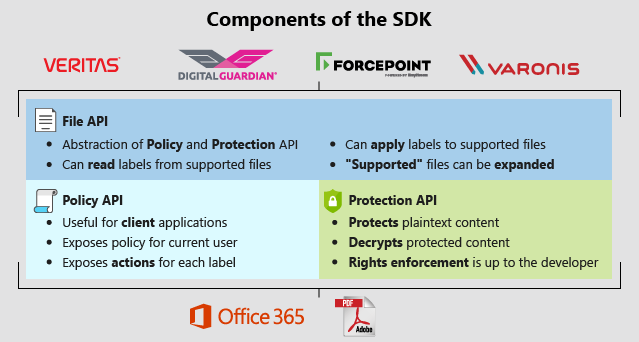

# Microsoft Information Protection SDK - API concepts

The Microsoft Information Protection (MIP) SDK is composed of three APIs, as shown in the following diagram:

Depending on your application's needs, you may want to interface at the File API layer, or may need to work directly with the Policy or Protection API layers.

## File API

The File API is an abstraction of both the Protection and Policy APIs. It provides easy-to-use interfaces for reading labels from the service, applying labels to defined file types, and reading labels from those files types. The File API will be used by any service or application where:

- a supported file type is involved
- labels must be read or written
- content must be protected or decrypted

### File API Use Cases

- You’re a software engineer at a financial services institution. You want to be sure that data from your LOB applications, typically exported in Excel format, are labeled on export based on the contents. The File API can be used to list available labels, then apply the appropriate label to a supported file format.

- Your organization develops a cloud access security broker (CASB). Your customers ask for the ability to apply MIP labels to Microsoft Office and PDF documents. The File API enables you to display a list of configured labels, then allow your customers to build rules that apply a given label. The File API, taking in the label ID, would handle the rest for files meeting the customer’s criteria.

- Your organization provides a service-based data loss prevention solution, or a CASB that monitors SaaS applications for file activity. To reduce the risk of data loss or exposure where data is protected with MIP, your service must scan the contents of protected files. Using File API for the supported formats, when the service is a privileged user it can:

  1. remove protection
  2. scan the contents for restricted or sensitive content
  3. discard the plaintext result
  4. apply a service rule to report on or remediate the risk, if found

## Policy API

The Policy API, or Universal Policy Engine (UPE), provides the ability for software developers to retrieve labeling policies for a specific user. It can then "compute" the actions those labels should take.

The Policy API is used primarily by client applications, where the developer controls the interface and file format. It's also used when the only requirement is to retrieve user policy, and not label files directly. 

### Policy API Use Cases

- Your organization develops 3D design software that uses a proprietary file format. Your customers use MIP, and want to apply labels natively through your application. As the software engineer, you use the Policy API and a custom control to display the labels available for the authenticated user. After the user selects a label, you call the compute action method of the API. The API tells you exactly what should be applied as far as metadata, content marking, and protection.

- Your organization develops a Data Loss Prevention (DLP) service, that allows your customers to configure DLP policies via a central administration portal. You have customers that use MIP, and need to read or apply AIP labels, as part of DLP policies. As the software engineer, you can use the Policy API to get a list of labels for the customer organization. You can then read those labels as part of a DLP rule, or apply the label information as part of a rule action.

## Protection API

The Protection API provides the ability for software developers to convert plaintext streams in to rights-managed streams, and vice-versa.

### Protection API Use Cases

- Your organization develops 3d printing software using a propriety file format. You want to use MIP to protect the file, so it can be printed only by specific users. Using the Protection API, you can apply protection to the file so that only authorized consumers can open and print it. 

- Your organization develops an eDiscovery solution that processes Exchange mailboxes and .PST files. Your application needs to allow users to decrypt messages to perform eDiscovery. Using a custom message/RPMSG parser and a sufficiently privileged account, you can use the RMS API to:
  - decrypt the encrypted file
  - scan the contents
  - discard if out of scope, or package if in scope

## Next steps

Now that you have a general idea of the available MIP APIs and how they're used, continue with [Profile and Engine object concepts](concept-profile-engine-cpp.md). These concepts are fundamental, and apply to all MIP API sets.