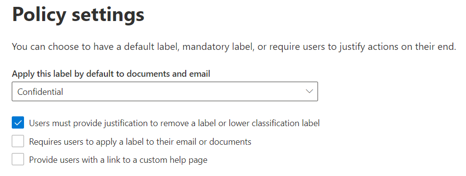

# Action Justification in MIP SDK

## Overview

Label policies in Security and Compliance Center allow administrators to require **justification** upon removal or downgrade of a label. Downgrade is defined as applying a label that has a lower sensitivity value in place of the existing label.

As discussed previously, File SDK provides easy-to-use interfaces for reading labels from the service, applying labels to defined file types, and reading labels from those files types. It also supports file operations for removing and changing the labels for supported filetypes. Changes to the file label is supported through `mip::FileHandler`'s `SetLabel()` function which provides the ability to set a new label to an unprotected or previously protected file, and `mip::FileHandler`'s `DeleteLabel()` function which removes the label from a previously protected file.

For some of the sensitivity labels, security administrators might want to apply stricter policies, when a user attempts to downgrade the sensitivity by deleting a label or by changing the label to a less restrictive one. Administrators can configure this using label policy configuration in [security and compliance center](https://sip.compliance.microsoft.com/) by selecting the checkbox.

If the file has an existing label and the label policy requires justification in the event of a label downgrade, the `SetLabel()`/`DeleteLabel()` functions will throw `mip::JustificationRequiredError`. The application must catch this exception, then provide an application interface to the user to provide input on the reason for downgrade. Once the justification is recorded, the application can set property `isDowngradeJustified` of `mip::LabelingOptions`, as well as setting the `Justification` property.

## Next Steps

- Review [Action Justification Quickstart for (C++)](quick-file-justify-actions-cpp.md)
- Review [Action Justification Quickstart for (C#)](quick-file-justify-actions-csharp.md)