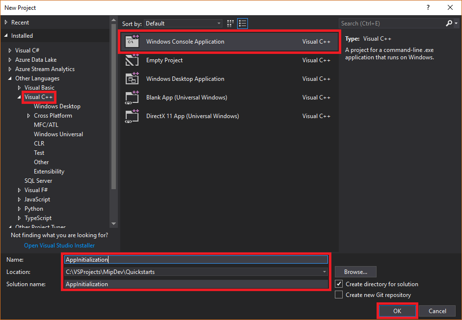
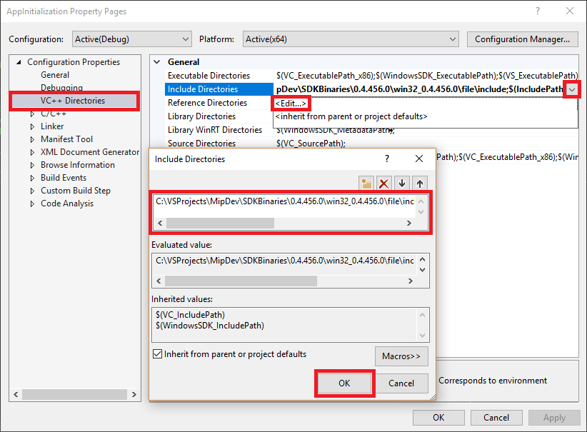
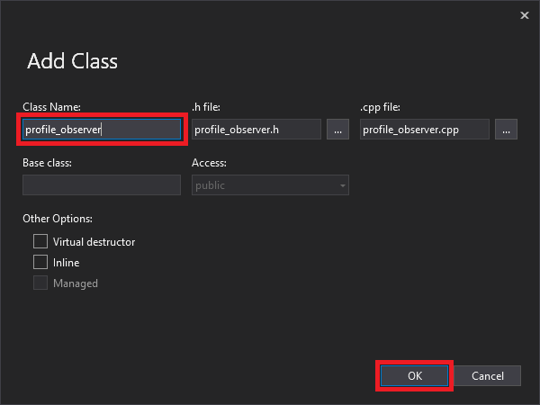

# Quickstart: Client application initialization (C++)

This quickstart illustrates the client initialization pattern used by the MIP C++ SDK at runtime. At a high level, all clients must accomplish the following initialization steps before using APIs:

- Acquire and provide a suitable OAuth2 access token to the SDK
- Initialize and provide a Profile object to the SDK
- Initialize and provide an Engine object to the SDK 

> [!NOTE]
> The steps outlined in this quickstart are required for any client application that uses the MIP File, Policy, or Protection APIs.  Although this quickstart demonstrates File API examples, this same pattern is applicable to clients using the Policy and Protection APIs.

## Prerequisites

If you haven't already, be sure to:

- Complete the steps in [Microsoft Information Protection (MIP) SDK setup and configuration](setup-configure-mip.md).
- Review [Observers in the MIP SDK](concept-async-observers.md) to learn more about observer concepts, and how they're implemented. The MIP SDK makes use of the observer pattern to implement asynchronous event notifications.

## Create a Visual Studio solution and project

Here we create the initial Visual Studio solution and project, upon which the following Quickstarts will build. 

1. Create a new Visual Studio solution:

   - Open Visual Studio 2017, select **File**, **New**, **Project**.
   - In the **New Project** dialog:
     - In the left pane, under **Installed**, **Other Languages**, select **Visual C++**.
     - In the center pane, select **Windows Console Application**
     - In the bottom pane, update the project **Name**, **Location**, and the containing **Solution name** accordingly.
     - When finished, click the **OK** button in the lower right.

     [](media/quick-app-initialization-cpp/create-vs-solution.png#lightbox)

2. Configure the include and library directory paths in your project settings. These directories were established as part of the [MIP SDK setup and configuration](setup-configure-mip.md#configure-your-client-workstation) prerequisite:
   - In the **Solution Explorer**, right click on the project node (directly under the top/solution node), and select **Properties**.
   - On the **Property Pages** dialog, under **Configuration Properties**, select the **VC++ Directories** node.
   - Select the **Include Directories** row then click the drop-down on the right side, then **<Edit...>**, and enter the path(s) to the SDK include subdirectories in the top field. Click **OK**. Be sure to specify the `\include` subdirectories (but no deeper), within the directory where you installed the SDK.
   - Repeat the previous step for the **Library Directories** row, entering the path(s) to the SDK library subdirectories. Be sure to select the paths that match the current build configuration for your solution (debug/release target, and platform). Be sure to specify the `\bins\<target>\<platform>` subdirectories, within the directory where you installed the SDK.
   - Click **OK** on the **Property Pages** dialog when finished.

     [](media/quick-app-initialization-cpp/set-include-lib-path-properties.png#lightbox)

3. Add the SDK binaries path to the PATH environment variable, to allow the SDK .DLL files to be found at runtime:
   - Click the Windows icon in the lower left.
   - Type "Path" and press the "Enter" key, when you see the **Edit the system environment variables** item show.
   - On the **System Properties** dialog, click **Environment Variables**.
   - Click the **Path** row under **User variables for \<user\>**, then click **Edit...**
   - Click **New**, enter the same `\bins\<target>\<platform>` subdirectory path(s) you entered earlier for the SDK libraries, and click **OK**.

## Implement an observer class

Now create a basic implementation for an observer class, by extending the SDK's `FileProfile::Observer` class. The observer is instantied and used later, during initialization of the File profile and engine objects.

1. Add a new class to your project, which generates both the header/.h and implementation/.cpp files for you:

   - In the **Solution Explorer**, right click on the project node, select **Add**, then select **Class**.
   - On the **Add Class** dialog:
     - In the **Class Name** field, enter "profile_observer". You'll notice that both the **.h file** and **.cpp file** fields are automatically populated, based on the name you enter.
     - When finished, click the **OK** button.

     [](media/quick-app-initialization-cpp/add-class.png#lightbox)

2. After generating the .h and .cpp files for the class, both files will be opened in tabs, in the Editor Groups portion of the Visual Studio user interface. Now update each file to implement the new observer class:

   - Update "profile_observer.h", by selecting/deleting its contents, then copy/paste the following into the file:

     ```cpp
     #include <memory>
     #include "mip/file/file_profile.h"

     class ProfileObserver final : public mip::FileProfile::Observer {
     public:
          ProfileObserver() { }
	        // Observer implementation
	        void OnLoadSuccess(const std::shared_ptr<mip::FileProfile>& profile, const std::shared_ptr<void>& context) override;
	        void OnLoadFailure(const std::exception_ptr& error, const std::shared_ptr<void>& context) override;
	        void OnAddEngineSuccess(const std::shared_ptr<mip::FileEngine>& engine, const std::shared_ptr<void>& context) override;
	        void OnAddEngineError(const std::exception_ptr& error, const std::shared_ptr<void>& context) override;
     };
     ```

   - Update "profile_observer.cpp", by selecting/deleting its contents, then copy/paste the following into the file:

     ```cpp
     #include "profile_observer.h"
     #include <future>

     using std::promise;
     using std::shared_ptr;
     using std::static_pointer_cast;
     using mip::FileEngine;
     using mip::FileProfile;

     void ProfileObserver::OnLoadSuccess(const shared_ptr<FileProfile>& profile, const shared_ptr<void>& context) {
          auto promise = static_pointer_cast<std::promise<shared_ptr<FileProfile>>>(context);
          promise->set_value(profile);
     }

     void ProfileObserver::OnLoadFailure(const std::exception_ptr& error, const shared_ptr<void>& context) {
          auto promise = static_pointer_cast<std::promise<shared_ptr<FileProfile>>>(context);
          promise->set_exception(error);
     }

     void ProfileObserver::OnAddEngineSuccess(const shared_ptr<FileEngine>& engine, const shared_ptr<void>& context) {
          auto promise = static_pointer_cast<std::promise<shared_ptr<FileEngine>>>(context);
          promise->set_value(engine);
     }

     void ProfileObserver::OnAddEngineError(const std::exception_ptr& error, const shared_ptr<void>& context) {
          auto promise = static_pointer_cast<std::promise<shared_ptr<FileEngine>>>(context);
          promise->set_exception(error);
     }
     ``` 

## Implement the authentication delegate

TODO: We go through a native app, but call out Web app similarites/differences.

As mentioned, the client is also responsible for acquiring a suitable OAuth2 access token, and providing it to the MIP SDK. Token acquisition is accomplished in the implementation of a delegate class, which extends the `mip::AuthDelegate` class. The delegate implementation provides the preferred method of authentication, when requested by the SDK at run-time.  

`mip::AuthDelegate` contains nested classes `OAuth2Challenge` and `OAuth2Token`, and defines the pure virtual function `mip::AuthDelegate::AcquireOAuth2Token`. `AcquireOAuth2Token` must be extended by developers, to define the preferred method of access token acquisition:

```cpp
class AuthDelegate {
public:
  class OAuth2Challenge {           // Manages OAuth2 authority info
  ...
  };

  class OAuth2Token {               // Manages OAuth2 access token acquisition and storage
  ...
  };

  virtual bool AcquireOAuth2Token(  // Called when an OAuth2 access token is required by SDK client app
      const mip::Identity& identity,
      const OAuth2Challenge& challenge,
      OAuth2Token& token) = 0;
};
```

1. Extend `mip::AuthDelegate` and override `mip::AuthDelegate::AcquireOAuth2Token`

The SDK calls the client application's implementation of `mip::AuthDelegate::AcquireOAuth2Token`, with three parameters:

- `mip::Identity`: The identity of the user or service to be authenticated, if known.
- `mip::AuthDelegate::OAuth2Challenge`: Contains the **authority** and **resource**. **Authority** is the service the access token will be generated against. **Resource** is the service being accessed. 
- `mip::AuthDelegate::OAuth2Token`: The client application updates with the token result. It will be consumed by the SDK when the engine is loaded. It shouldn't be necessary to get or set this value anywhere outside of the `AcquireOAuth2Token` implementation.

2. Write the access token acquisition logic.

3. Return a token acquisition status to the SDK. When `AcquireOAuth2Token` is finished, the client must return a bool that indicates whether token acquisition was successful.

>[!Important]
> Applications won't ever have to call `AcquireOAuth2Token` directly. The SDK will call this method  when required.

### Implement a consent delegate (TBD - since this article is a QS, and consent is a slightly advanced concept, should probably leave in concepts (updated using below format) and point to it?)

The `mip::Consent` enum class implements an easy-to-use approach that permits application developers to provide a custom consent experience based on the endpoint that is being accessed by the SDK. The notification can inform a user of the data that will be collected, how to get the data removed, or any other information that is required by law or compliance policies. Once the user grants consent, the application can continue. 

GDPR info here? 
Exception details?

1. Extend the `mip::Consent` base class - Consent is implemented by extending the `mip::Consent` base class and implementing `GetUserConsent` to return one of the `mip::Consent` enum values. 

The object derived from `mip::Consent` is passed in to the `mip::FileProfile::Settings` or `mip::ProtectionProfile::Settings` constructor.

When a user performs an operation that would require providing consent, the SDK calls the `GetUserConsent` method, passing in the destination URL as the parameter. It's in this method where one would implement displaying the necessary information to the user, allowing them to make a decision on whether or not they consent to using the service. 

Operations that will trigger the consent flow are (TBD):

- One
- Two

2. Setting consent options -

- **AcceptAlways**: Consent and remember the decision.
- **Accept**: Consent once.
- **Reject**: Do not consent.

When the SDK requests user consent with this method, the client
application should present the URL to the user. Client applications should
provide some means of obtaining user consent and return the appropriate
Consent enum that corresponds to the user's decision.

Sample consent delegate implementation:

#### consent_delegate_impl.h

```cpp
class ConsentDelegateImpl final : public mip::ConsentDelegate {
public:
  ConsentDelegateImpl() = default;
  
  virtual mip::Consent GetUserConsent(const std::string& url) override;

};
```

#### consent_delegate_impl.cpp

When the SDK requires consent, the `GetUserConsent` method is called *by the SDK*, and the URL passed in as a parameter. In the example below, the user is notified that the SDK will connect to that provided URL, then returns `Consent::AcceptAlways`. This example isn't a good implementation, as the user wasn't presented with a real choice.

```console
Consent ConsentDelegateImpl::GetUserConsent(const string& url) {
  //Print the consent URL, ask user to choose
  std::cout << "SDK will connect to: " << url << std::endl;

  std::cout << "1) Accept Always" << std::endl;
  std::cout << "2) Accept" << std::endl;
  std::cout << "3) Reject" << std::endl;
  std::cout << "Select an option: ";
  char input;
  std::cin >> input;

  switch (input)
  {
  case '1':
    return Consent::AcceptAlways;
    break;
  case '2':
    return Consent::Accept;
    break;
  case '3':
    return Consent::Reject;
    break;
  default:
    return Consent::Reject;
  }  
}
```

## Implement a File profile object

From: https://github.com/tommoser/build-ILL-mip-sdk/wiki/Build-2018-Workshop-Instructions#fileprofile 
From: https://github.com/MicrosoftDocs/Azure-RMSDocs-pr/blob/release-mip/mip/develop/tutorial-file/profile.md 


## Implement an File engine object

From: https://github.com/tommoser/build-ILL-mip-sdk/wiki/Build-2018-Workshop-Instructions#engine 
From: https://github.com/MicrosoftDocs/Azure-RMSDocs-pr/blob/release-mip/mip/develop/tutorial-file/engine.md 

## Test the application

(TBD) - show sample output here, but DON'T USE THIS block

```cmd
Non-Business : 87ba5c36-b7cf-4793-bbc2-bd5b3a9f95ca
Public : 87867195-f2b8-4ac2-b0b6-6bb73cb33afc
General : f42aa342-8706-4288-bd11-ebb85995028c
Confidential : 074e257c-5848-4582-9a6f-34a182080e71
->  Microsoft FTE : d9f23ae3-a239-45ea-bf23-f515f824c57b
->  Microsoft Extended : 9fbde396-1a24-4c79-8edf-9254a0f35055
Highly Confidential : f5dc2dea-db0f-47cd-8b20-a52e1590fb64
->  Microsoft FTE : f74878b7-c0ff-44a4-82ff-8ce29f7fccb5
->  Microsoft Extended : c179f820-d535-4b2f-b252-8a9c4ac14ec6
Press any key to continue . . .
```

## Next Steps

Now you're ready for the next quickstart, where you'll start to experience the MIP File APIs.

> [!div class="nextstepaction"]
> [List sensitivity labels](quick-file-list-labels-cpp.md)