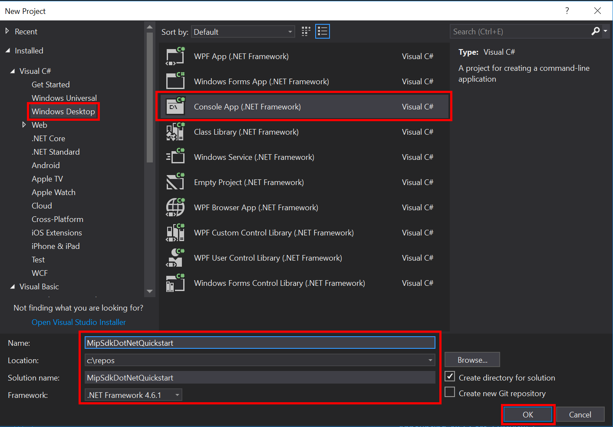

# Quickstart: Client application initialization (C#)

This quickstart will show you how to implement the client initialization pattern, used by the MIP SDK .NET wrapper at runtime.

> [!NOTE]
> The steps outlined in this quickstart are required for any client application that uses the MIP .NET wrapper's File or Policy APIs. The Protection API is not yet available. Although this Quickstart demonstrates usage of the File APIs, this same pattern is applicable to clients using the Policy and Protection APIs. Future Quickstarts should be done serially, as each one builds on the previous one, with this one being the first.

## Prerequisites

If you haven't already, be sure to:

- Complete the steps in [Microsoft Information Protection (MIP) SDK setup and configuration](setup-configure-mip.md). This "Client application initialization" Quickstart relies on proper SDK setup and configuration.
- Optionally:
  - Review [Profile and engine objects](concept-profile-engine-cpp.md). The profile and engine objects are universal concepts, required by clients that use the MIP File/Policy/Protection APIs. 
  - Review [Authentication concepts](concept-authentication-cpp.md) to learn how authentication and consent are implemented by the SDK and client application.
  - Review [Observer concepts](concept-async-observers.md) to learn more about observers, and how they're implemented. The MIP SDK makes use of the observer pattern to implement asynchronous event notifications.

## Create a Visual Studio solution and project

First we create and configure the initial Visual Studio solution and project, upon which the other Quickstarts will build.

1. Open Visual Studio 2017, select the **File** menu, **New**, **Project**. In the **New Project** dialog:
   - In the left pane, under **Installed**, **Visual C#**, select **Windows Desktop**.
   - In the center pane, select **Console App (.NET Framework)**
   - In the bottom pane, update the project **Name**, **Location**, and the containing **Solution name** accordingly.
   - When finished, click the **OK** button in the lower right. 

     [](media/quick-app-initialization-csharp/create-vs-solution.png#lightbox)

2. Add the Nuget package for the MIP SDK File API to your project:
   - In the **Solution Explorer**, right click on the project node (directly under the top/solution node), and select **Manage NuGet packages...**:
   - When the **NuGet Package Manager** tab opens in the Editor Group tabs area:
     - Select **Browse**.
     - Enter "Microsoft.InformationProtection" in the search box.
     - Select the "Microsoft.InformationProtection.File" package.
     - Click "Install", then click "OK" when the **Preview changes** confirmation dialog displays.

3. Repeat the steps above for adding the MIP SDK File API package, but instead add "Microsoft.IdentityModel.Clients.ActiveDirectory" to the application.

## Implement an authentication delegate

The MIP SDK implements authentication using class extensibility, which provides a mechanism to share authentication work with the client application. The client must acquire a suitable OAuth2 access token, and provide to the MIP SDK at runtime.

Now create an implementation for an authentication delegate, by extending the SDK's `Microsoft.InformationProtection.IAuthDelegate` interface, and overriding/implementing the `IAuthDelegate.AcquireToken()` virtual function. The authentication delegate is instantiated and used later by the `FileProfile` and `FileEngine` objects.

1. Right-click the project name in Visual Studio, select **Add** then **Class**.
2. Enter "AuthDelegateImplementation" in the **Name** field. Click **Add**.
3. Add using statements for the Active Directory Authentication Library (ADAL) and the MIP library:

     ```csharp
     using Microsoft.InformationProtection;
     using Microsoft.IdentityModel.Clients.ActiveDirectory;
     ```

4. Set `AuthDelegateImplementation` to inherit `Microsoft.InformationProtection.IAuthDelegate` and implement a private variable of `Microsoft.InformationProtection.ApplicationInfo` and a constructor that accepts the same type.

     ```csharp
     public class AuthDelegateImplementation : IAuthDelegate
     {
        private ApplicationInfo _appInfo;
        private string redirectUri = "mip-sdk-app://authorize";
        public AuthDelegateImplementation(ApplicationInfo appInfo)
        {
            _appInfo = appInfo;
        }
     }
     ```

The `ApplicationInfo` object contains two properties. The `_appInfo.ApplicationId` will be used in the `AuthDelegateImplementation` class to provide the client ID to the auth library.

5. Add the `public string AcquireToken()` class. This class should accept `Microsoft.InformationProtection.Identity`, and two strings: authority and resource. These string variables will be passed in to the authentication library by the API and shouldn't be manipulated. Editing may result in a failure to authenticate.

     ```csharp
     public string AcquireToken(Identity identity, string authority, string resource)
     {
          AuthenticationContext authContext = new AuthenticationContext(authority);
          var result = authContext.AcquireTokenAsync(resource, _appInfo.ApplicationId, new Uri(redirectUri), new PlatformParameters(PromptBehavior.Auto, null), UserIdentifier.AnyUser).Result;
          return result.AccessToken;
     }
     ```

## Implement a consent delegate

Now create an implementation for a consent delegate, by extending the SDK's `Microsoft.InformationProtection.IConsentDelegate` interface, and overriding/implementing `GetUserConsent()`. The consent delegate is instantiated and used later, by the File profile and File engine objects. The consent delegate is provided with the address of the service the user must consent to using in the `url` parameter. The delegate should generally provide some flow that allows the user to accept or reject to consent to accessing the service. For this quickstart hard code `Consent.Accept`.

1. Using the same Visual Studio "Add Class" feature we used previously, add another class to your project. This time, enter "ConsentDelegateImplementation" in the **Class Name** field. 

2. Now update **ConsentDelegateImpl.cs** to implement your new consent delegate class. Add the using statement for `Microsoft.InformationProtection` and set the class to inherit `IConsentDelegate`.

     ```csharp
     class ConsentDelegateImplementation : IConsentDelegate
     {
          public Consent GetUserConsent(string url)
          {
               return Consent.Accept;
          }
     }
     ```

3. Optionally, attempt to build the solution to ensure that it compiles with no errors.

## Initialize the MIP SDK Managed Wrapper

1. From **Solution Explorer**, open the .cs file in your project that contains the implementation of the `Main()` method. It defaults to the same name as the project containing it, which you specified during project creation.

2. Remove the generated implementation of `main()`. 

3. The managed wrapper includes a static class, `Microsoft.InformationProtection.MIP` used for initialization, loading profiles, and releasing resources. To initialize the wrapper for file API operations, call MIP.Initialize, passing in `MipComponent.File` to load the libraries necessary for file operations. 

4. In `Main()` in *Program.cs* add the following, replacing **\<application-id\>** with the ID of the Azure AD Application Registration created previously.

```csharp
using System;
using System.Threading.Tasks;
using Microsoft.InformationProtection;
using Microsoft.InformationProtection.File;

namespace mip_sdk_dotnet_quickstart
{
    class Program
    {
        private const string clientId = "<application-id>";
        private const string appName = "<friendly-name>";

        static void Main(string[] args)
        {
            //Initialize Wrapper for File API operations 
            MIP.Initialize(MipComponent.File);
        }
    }
}
```

## Construct a File Profile and Engine

As mentioned, profile and engine objects are required for SDK clients using MIP APIs. Complete the coding portion of this Quickstart, by adding code to load the native DLLs then instantiate the profile and engine objects.

   ```csharp
using System;
using System.Threading.Tasks;
using Microsoft.InformationProtection;
using Microsoft.InformationProtection.File;

namespace mip_sdk_dotnet_quickstart
{
     class Program
     {
          private const string clientId = "<application-id>";
          private const string appName = "<friendly-name>";

          static void Main(string[] args)
          {
               //Initialize Wrapper for File API operations
               MIP.Initialize(MipComponent.File);

               //Create ApplicationInfo, setting the clientID from Azure AD App Registration as the ApplicationId
               ApplicationInfo appInfo = new ApplicationInfo()
               {
                    ApplicationId = clientId,
                    ApplicationName = appName,
                    ApplicationVersion = "1.0.0"
               };

               //Instatiate the AuthDelegateImpl object, passing in AppInfo. 
               AuthDelegateImplementation authDelegate = new AuthDelegateImplementation(appInfo);

               //Initialize and instantiate the File Profile
               //Create the FileProfileSettings object
               var profileSettings = new FileProfileSettings("mip_data", false, authDelegate, new ConsentDelegateImplementation(), appInfo, LogLevel.Trace);

               //Load the Profile async and wait for the result
               var fileProfile = Task.Run(async () => await MIP.LoadFileProfileAsync(profileSettings)).Result;

               //Create a FileEngineSettings object, then use that to add an engine to the profile
               var engineSettings = new FileEngineSettings("user1@tenant.com", "", "en-US");
               engineSettings.Identity = new Identity("user1@tenant.com");
               var fileEngine = Task.Run(async () => await fileProfile.AddEngineAsync(engineSettings)).Result;
          }
     }
}
``` 

3. Replace the placeholder values in the source code that you pasted in, using the following values:

   | Placeholder | Value | Example |
   |:----------- |:----- |:--------|
   | \<application-id\> | The Azure AD Application ID assigned to the application registered in "MIP SDK setup and configuration" (2 instances).  | 0edbblll-8773-44de-b87c-b8c6276d41eb |
   | \<friendly-name\> | A user-defined friendly name for your application. | AppInitialization |


4. Now do a final build of the application and resolve any errors. Your code should build successfully.

## Next Steps

Now that your initialization code is complete, you're ready for the next quickstart, where you'll start to experience the MIP File APIs.

> [!div class="nextstepaction"]
> [List sensitivity labels](quick-file-list-labels-csharp.md)
