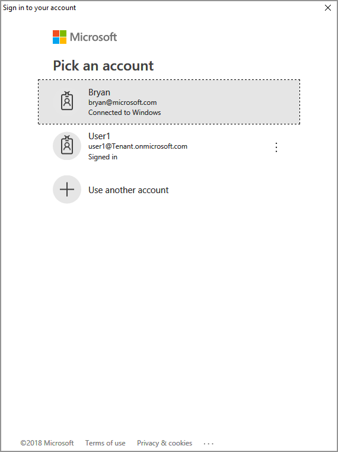
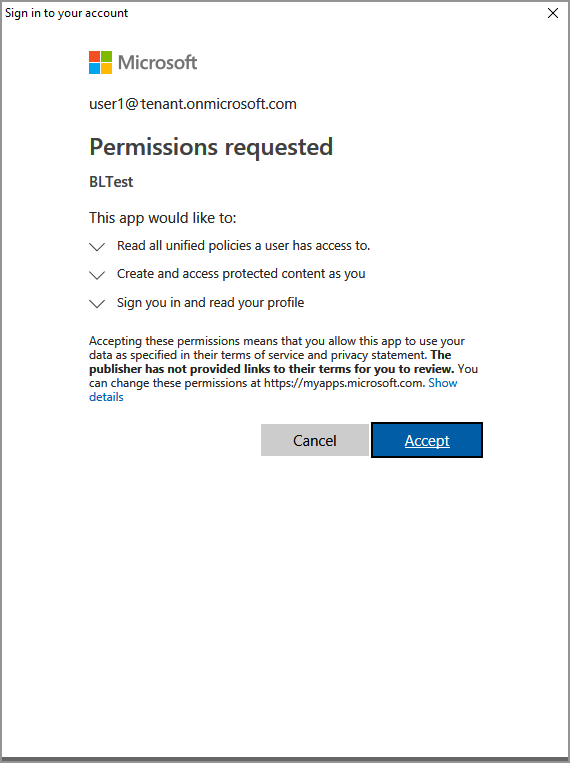

# Quickstart: List sensitivity labels (C++)

This Quickstart shows you how to use the MIP File API, to list the sensitivity labels configured for your organization.

## Prerequisites

If you haven't already, be sure to complete the following prerequisites before continuing:

- Complete [Quickstart: Client application initialization (C++)](quick-app-initialization-cpp.md) first, which builds a starter Visual Studio solution. This "List sensitivity labels" Quickstart relies on the previous one, for proper creation of the starter solution.
- Optionally: Review [Classification labels](concept-classification-labels.md) concepts.

## Add logic to list the sensitivity labels

Add logic to list your organization's sensitivity labels, using the File engine object. 

1. Open the Visual Studio solution you created in the previous "Quickstart: Client application initialization (C++)" article.

2. Using **Solution Explorer**, open the .cpp file in your project that contains the implementation of the `main()` method. It defaults to the same name as the project containing it, which you specified during project creation. 

3. Add the following `using` directive after `using mip::FileEngine;`, near the top of the file:

   ```cpp
   using std::endl;
   ```

4. Toward the end of the `main()` body, below the closing brace `}` of the `catch` block and above `return 0;` (where you left off in the previous Quickstart), insert the following code:

   ```cpp
   // List sensitivity labels
   cout << "\nSensitivity labels for your organization:\n";
   auto labels = engine->ListSensitivityLabels();
   for (const auto& label : labels)
   {
      cout << label->GetName() << " : " << label->GetId() << endl;

      for (const auto& child : label->GetChildren())
      {
        cout << "->  " << child->GetName() << " : " << child->GetId() << endl;
      }
   }
   system("pause");
   ``` 

## Create a PowerShell script to generate access tokens

You use the following PowerShell script to generate access tokens, as requested by the SDK. The script uses the `Get-ADALToken` cmdlet from the ADAL.PS module you installed earlier, in "MIP SDK Setup and configuration". 

1. Create a PowerShell Script file (.ps1 extension), and copy/paste the following script into the file:

   - Update the `$appId` and `$redirectUri` variables, to match the values specified in your Azure AD app registration. 
   - `$authority` and `$resourceUrl` are updated later, in the following section.

   ```powershell
   $authority = '<authority-url>'                   # Enforced by MIP SDK
   $resourceUrl = '<resource-url>'                  # Enforced by MIP SDK; matches a resource/API URL requested in the app registration
   $appId = '0edbblll-8773-44de-b87c-b8c6276d41eb'  # App ID of the Azure AD app registration
   $redirectUri = 'bltest://authorize'              # Must match the redirect URI of the Azure AD app registration
   $response = Get-ADALToken -Resource $resourceUrl -ClientId $appId -RedirectUri $redirectUri -Authority $authority -PromptBehavior:RefreshSession 
   $response.AccessToken | clip                     # Copy the access token text to the clipboard
   ```

2. Save the script file so you can run it later, as requested by your client application.

## Build and test the application

Finally, build and test your client application. 

1. Use F6 (**Build Solution**) to build your client application. If you have no build errors, use F5 (**Start debugging**) to run your application.

2. If your project builds and runs successfully, the application will prompt for an access token, each time the SDK calls your `AcquireOAuth2Token()` method. You can reuse a previously generated token, if prompted multiple times and the requested values are the same:

   ```cmd
   Run the PowerShell script to generate an access token using the following values, then copy/paste it below:
   Set $authority to: https://login.windows.net/common/oauth2/authorize
   Set $resourceUrl to: https://syncservice.o365syncservice.com/
   Be sure to sign in with user account: user1@tenant.onmicrosoft.com
   Enter access token:
   ```

3. To provide a response to the above prompt, go back to your PowerShell script and:

   - Update the `$authority` and `$resourceUrl` variables. They must match the values that are specified in the console output in step #2. These values are provided by the MIP SDK in the `challenge` parameter of `AcquireOAuth2Token()`:
     - `$authority` should be `https://login.windows.net/common/oauth2/authorize`
     - `$resourceUrl` should be `https://syncservice.o365syncservice.com/` or `https://aadrm.com`
   - Run the PowerShell script. The `Get-ADALToken` cmdlet triggers an Azure AD authentication prompt similar to the following example. Specify the same account provided in the console output in step #2. After successful sign-in, the access token will be placed on the clipboard.

     [](media/quick-file-list-labels-cpp/acquire-token-sign-in.png#lightbox)

   - You may also need to give consent, to allow the application to access the MIP APIs, while running under the sign-in account. This happens when the Azure AD application registration isn't pre-consented (as outlined in "MIP SDK setup and configuration"), or you're signing in with an account from a different tenant (other than the one where your application is registered). Simply click **Accept** to record your consent.

     [](media/quick-file-list-labels-cpp/acquire-token-sign-in-consent.png#lightbox)

4. After supplying the access token(s), your console output should show the sensitivity labels, similar to the following example:

   ```cmd
   Non-Business : 87ba5c36-17cf-14793-bbc2-bd5b3a9f95cz
   Public : 83867195-f2b8-2ac2-b0b6-6bb73cb33afz
   General : f42a3342-8706-4288-bd31-ebb85995028z
   Confidential : 074e457c-5848-4542-9a6f-34a182080e7z
   Highly Confidential : f55c2dea-db0f-47cd-8520-a52e1590fb6z

   Press any key to continue . . .
   ```

> [!NOTE]
> Copy and save the ID of one or more of the sensitivity labels (for example, `f42a3342-8706-4288-bd31-ebb85995028z`), as you will use it in the next Quickstart.

## Troubleshooting

### Problems during execution of PowerShell script 

| Summary | Error message | Solution |
|---------|---------------|----------|
| Incorrect redirect URI in application registration or PowerShell script (AADSTS50011) |*AADSTS50011: The reply url specified in the request does not match the reply urls configured for the application: 'ac6348d6-0d2f-4786-af33-07ad46e69bfc'.* | Verify the redirect URI being used, by completing one of the following steps:<br><br><li>Update the Redirect URI in your Azure AD application configuration, to match your PowerShell script. See [MIP SDK setup and configuration](setup-configure-mip.md#register-a-client-application-with-azure-active-directory) to verify that you've correctly configured the Redirect URI property.<br><li>Update the `redirectUri` variable in your PowerShell script, to match your application registration. |
| Incorrect sign-in account (AADSTS50020) | *AADSTS50020: User account 'user@domain.com' from identity provider 'https://sts.windows.net/72f988bl-86f1-41af-91ab-2d7cd011db47/' does not exist in tenant 'Organization name' and cannot access the application '0edbblll-8773-44de-b87c-b8c6276d41eb' in that tenant.* | Complete one of the following steps:<br><br><li>Rerun the PowerShell script, but be sure to use an account from the same tenant where your Azure AD application is registered.<br><li>If your sign-in account was correct, your PowerShell host session may already be authenticated under a different account. In this case, exit the script host then reopen, then try running it again.<br><li>If you're using this Quickstart with a web app (instead of native), and need to sign in using an account from a different tenant, be sure your Azure AD application registration is enabled for multi-tenant use. You can verify by using the "edit Manifest" feature in the application registration, and ensure it specifies `"availableToOtherTenants": true,`. |
| Incorrect permissions in application registration (AADSTS65005) | *AADSTS65005: Invalid resource. The client has requested access to a resource, which is not listed in the requested permissions in the client's application registration. Client app ID: 0edbblll-8773-44de-b87c-b8c6276d41eb. Resource value from request: https://syncservice.o365syncservice.com/. Resource app ID: 870c4f2e-85b6-4d43-bdda-6ed9a579b725. List of valid resources from app registration: 00000002-0000-0000-c000-000000000000.* | Update the permission requests in your Azure AD application configuration. See [MIP SDK setup and configuration](setup-configure-mip.md#register-a-client-application-with-azure-active-directory) to verify that you've correctly configured the permission requests in your application registration. |

### Problems during execution of C++ application

| Summary | Error message | Solution |
|---------|---------------|----------|
| Bad access token | *An exception occurred... is the access token incorrect/expired?<br><br>Failed API call: profile_add_engine_async Failed with: [class mip::PolicySyncException] Failed acquiring policy, Request failed with http status code: 401, x-ms-diagnostics: [2000001;reason="OAuth token submitted with the request cannot be parsed.";error_category="invalid_token"], correlationId:[35bc0023-3727-4eff-8062-000006d5d672]'<br><br>C:\VSProjects\MipDev\Quickstarts\AppInitialization\x64\Debug\AppInitialization.exe (process 29924) exited with code 0.<br><br>Press any key to close this window . . .* | If your project builds successfully, but you see output similar to the left, you likely have an invalid or expired token in your `AcquireOAuth2Token()` method. Go back to [Update the token acquisition logic](#update-the-token-acquisition-logic-with-a-valid-access-token) and regenerate the access token, update `AcquireOAuth2Token()` again, and rebuild/retest. You can also examine and verify the token and its claims, using the [jwt.ms](https://jwt.ms/) single-page web application. |
| Sensitivity labels aren't configured | n/a | If your project builds successfully, but you have no output in the console window, be sure your organization's sensitivity labels are configured correctly. See [MIP SDK setup and configuration](setup-configure-mip.md), under "Define label taxonomy and protection settings" for details.  |

## Next Steps

Now that you've learned how to list the sensitivity labels for your organization, try the next quickstart:

> [!div class="nextstepaction"]
> [Set and get a sensitivity label](quick-file-set-get-label-cpp.md)
