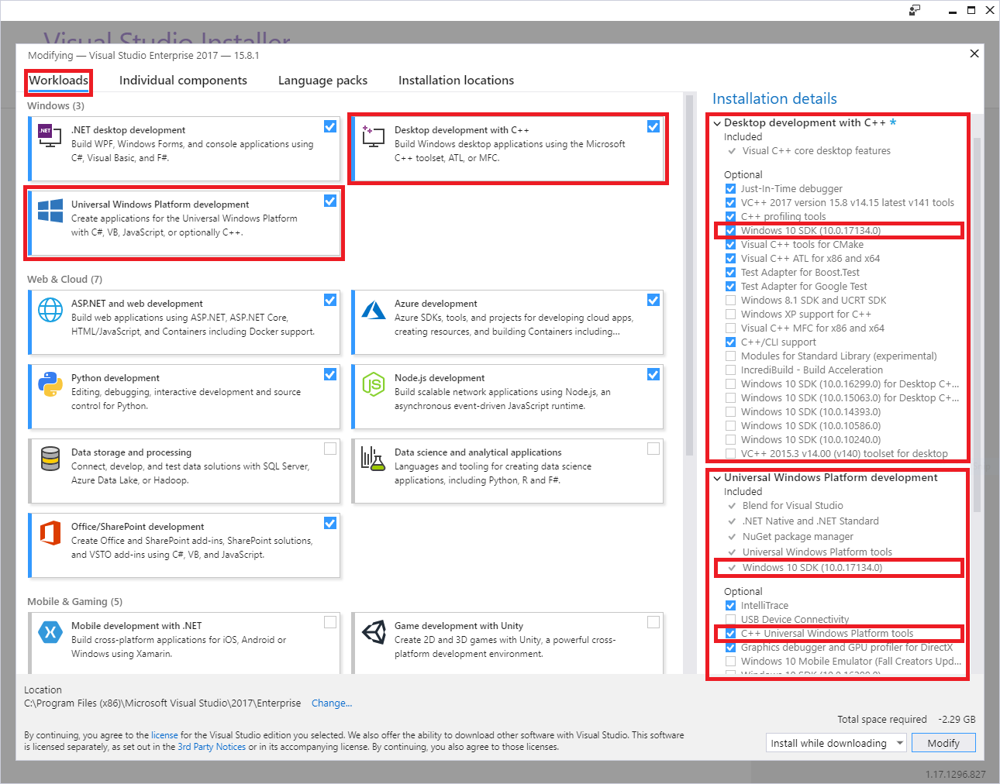
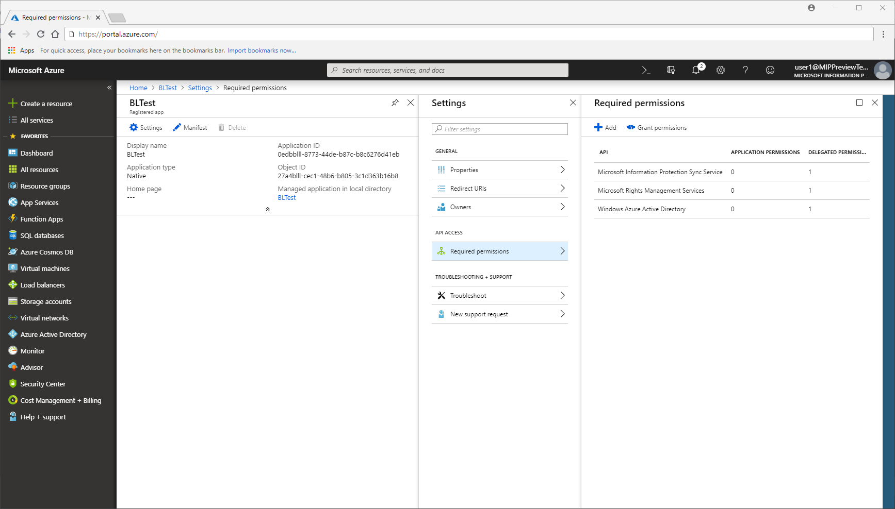

# Microsoft Information Protection (MIP) SDK setup and configuration 

The Quickstart and Tutorial articles are centered around building applications that use the MIP SDK libraries and APIs. This article shows you how to set up and configure your Office 365 subscription and client workstation, in preparation for using the SDK.

Be sure to review the following topics before getting started:

- [What is Office 365 Security and Compliance Center?](https://docs.microsoft.com/office365/securitycompliance/security-and-compliance)
- [What is Azure Information Protection?](/azure/information-protection/understand-explore/what-is-information-protection.md)
- [How does the protection work in Azure Information Protection?](/azure/information-protection/understand-explore/what-is-information-protection.md#how-data-is-protected)

The MIP SDK is supported on the following platforms:

| Operating system | Versions |  
|------------------|----------|
| Ubuntu  |  16.04 |
| RedHat Enterprise Linux | 7 with devtoolset-7 |
| Debian  | 9 |
| macOS   | High Sierra and later |
| Windows | All supported versions, 32 and 64 bit |

## Sign up for an Office 365 subscription


Many of the SDK samples require access to an Office 365 subscription. If you haven't already, be sure to sign up for one of the following subscription types:

| Name | Sign-up |
|------|---------|
| Office 365 Enterprise E3 Trial (30-day free trial) | https://go.microsoft.com/fwlink/p/?LinkID=403802 |
| Office 365 Enterprise E3 or E5 | https://products.office.com/business/office-365-enterprise-e3-business-software |
| Enterprise Mobility and Security E3 or E5 | https://www.microsoft.com/cloud-platform/enterprise-mobility-security |
| Azure Information Protection Premium P1 or P2 | https://azure.microsoft.com/pricing/details/information-protection/ |
| Microsoft 365 E3, E5, or F1 | https://www.microsoft.com/en-us/microsoft-365/compare-all-microsoft-365-plans | 

## Configure your client workstation

Next, complete the following steps to ensure your client computer is set up and configured correctly.

### Windows 10

1. Using Windows Update, update your machine to Windows 10 Fall Creators Update (version 1709) or later. To  verify your current version:
    - Click the Windows icon in the lower left.
    - Type "About your PC" and press the "Enter" key.
    - Scroll down to **Windows specifications** and look under **Version**.

2. Install [Visual Studio 2017](https://visualstudio.microsoft.com/downloads/), with the following workloads and optional components:
    - **Universal Windows Platform development** Windows workload, plus the following optional components:
        - **C++ Universal Windows Platform tools**
        - **Windows 10 SDK 10.0.16299.0 SDK** or later, if not included by default
    - **Desktop development with C++** Windows workload, plus the following optional components:
        - **Windows 10 SDK 10.0.16299.0 SDK** or later, if not included by default 

        [](media/setup-mip-client/visual-studio-install.png#lightbox)

3. Install the [ADAL.PS PowerShell Module](https://www.powershellgallery.com/packages/ADAL.PS/3.19.4.2). 

   - Because administrator rights are required to install modules, first you need to either:

     - log on to your computer with an account that has Administrator rights.
     - run the Windows PowerShell session with elevated rights (Run as Administrator).

   - Then run the `install-module -name adal.ps` cmdlet:

     ```powershell
     PS C:\WINDOWS\system32> install-module -name adal.ps

     Untrusted repository
     You are installing the modules from an untrusted repository. If you trust this repository, change its
     InstallationPolicy value by running the Set-PSRepository cmdlet. Are you sure you want to install the modules from
     'PSGallery'?
     [Y] Yes  [A] Yes to All  [N] No  [L] No to All  [S] Suspend  [?] Help (default is "N"): A

     PS C:\WINDOWS\system32>
     ```

4. Download SDK samples  

   - If you don't have one already, first create a [GitHub profile](https://github.com/join).
   - Then install the latest version of [Software Freedom Conservancy's Git client tools (Git Bash)](https://git-scm.com/download/)
   - Using Git Bash, download the sample(s) of interest:
     - Use the following query to view the repositories: https://github.com/Azure-Samples?utf8=%E2%9C%93&q=MipSdk. 
     - Using Git Bash, use `git clone https://github.com/azure-samples/<repo-name>` to download each sample repository.

5. Download SDK binaries

   A .zip file containing SDK binaries and headers for all platforms can be found at https://aka.ms/mipsdkbinaries. The .zip contains several additional .zip files, one for each platform and API. The files are named as follows, where \<API\> = `file`, `protection`, or `upe`, and \<OS\> = the platform: `mip_sdk_<API>_<OS>_1.0.0.0.zip (or .tar.gz)`.

   For example, the .zip for protection API binaries and headers on Debian would be: `mip_sdk_protection_debian9_1.0.0.0.tar.gz`.

   Each .zip or tarball contains three directories:

   - **Bins:** The compiled binaries for each platform architecture, where applicable.
   - **Include:** The Microsoft Information Protection SDK header files
   - **Samples:** Source code for the sample applications

   On Windows, the SDK can be installed via the NuGet package manager console:

    ```Powershell
    Install-Package Microsoft.InformationProtection.File
    Install-Package Microsoft.InformationProtection.Policy
    Install-Package Microsoft.InformationProtection.Protection
    ```  
6. Add the paths of the SDK binaries (dynamic link libraries (.dll)), to the PATH environment variable. This allows the dependent .DLLs to be found at runtime, by client applications:
   - Click the Windows icon in the lower left.
   - Type "Path" and press the "Enter" key, when you see the **Edit the system environment variables** item show.
   - On the **System Properties** dialog, click **Environment Variables**.
   - On the **Environment Variables** dialog, click the **Path** variable row under **User variables for \<user\>**, then click **Edit...**.
   - On the **Edit environment variable** dialog, click **New**, which creates a new editable row. Using the full path to each of the `file\bins\debug\amd64`, `protection\bins\debug\amd64`, and `upe\bins\debug\amd64` subdirectories, add a new row for each. The SDK directories are stored in a `<API>\bins\<target>\<platform>` format, where:
     - \<API\> = `file`, `protection`, `upe`
     - \<target\> = `debug`, `release`
     - \<platform\> = `amd64` (aka: x64), `x86`, etc.
   
   - When finished updating the **Path** variable, click **OK**. Then click **OK** when returned to the **Environment Variables** dialog.

7. Ensure "Developer Mode" is enabled on your workstation:
    - Click the Windows icon in the lower left.
    - Type "Use developer features" and press the "Enter" key, when you see the **Use Developer Features** item show.
    - On the **Settings** dialog, **For developers** tab, under "Use developer features", select the **Developer mode** option.
    - Close the **Settings** dialog.

## Register a client application with Azure Active Directory

As part of the Office 365 subscription provisioning process, an associated Azure AD tenant is created. The Azure AD tenant provides identity and access management for Office 365 *user accounts* and *application accounts*. Applications that require access to secured APIs (such as MIP APIs), require an application account.

For authentication and authorization at runtime, accounts are represented by a *security principal*, which is derived from the account's identity information. Security principals that represent an application account are referred to as a [*service principal*](/azure/active-directory/develop/developer-glossary#service-principal-object). 

To register an application account in Azure AD for use with the Quickstarts and MIP SDK samples:

  > [!IMPORTANT] 
  > To access Azure AD tenant management for account creation, you'll need to sign in to the Azure portal with a user account that is a member of the ["Owner" role on the subscription](/azure/billing/billing-add-change-azure-subscription-administrator). Depending on the configuration of your tenant, you may also need to be a member of the "Global Admininstrator" directory role to [register an application](https://ms.portal.azure.com/#blade/Microsoft_AAD_IAM/ActiveDirectoryMenuBlade/RegisteredApps).
  > We recommend testing with a restricted account. Be sure the account only has rights to access the necessary SCC endpoints. Cleartext passwords passed via commandline may be collected by logging systems.

1. Follow the steps in [Integrating applications with Azure Active Directory, Add an application section](/azure/active-directory/develop/quickstart-v1-integrate-apps-with-azure-ad#adding-an-application). For testing purposes, use the following values for the given properties as you go through the guide steps: 
    - **Application type** - Select "Native", as the applications demonstrated by the SDK are natively installed console applications. Native applications are considered "public" clients by OAuth2, as they are unable to store/use application credentials in a secure manner. Unlike a "confidential" server-based application, such as a web application, which is registered with its own credentials. 
    - **Redirect URI** - Since the SDK uses simple console client applications, use a URI in the format `<app-name>://authorize`.

2. When finished, you'll be returned to the **Registered app** page for your new application registration. Copy the GUID in the **Application ID** field, as you will need this later. 

3. Then click **Settings** to add the APIs and permissions to which the client will need access. On the **Settings** page, click **Required permissions**.

4. Now you'll add the MIP APIs and permissions the application will require at runtime:
   - On the **Required permissions** page, click **Add**. 
   - On the **Add API access** page, click **Select an API**.
   - On the **Select an API** page, click the "**Microsoft Rights Management Services**" API, and click **Select**.
   - On the **Enable Access** page for the API's available permissions, click "**Create and access protected content for users**", and click **Select**, then **Done**.

5. Repeat step #4, but this time when you get to the **Select an API** page, you'll need to search for the API.
   - On the **Select an API** page, in the search box type "**Microsoft Information Protection Sync Service**", then click the API and click **Select**.
   - On the **Enable Access** page for the API's available permissions, click "**Read all unified policies a user has access to**", and click **Select**, then **Done**

6. When you're back on the **Required Permissions** page, click **Grant Permissions**, then **Yes**. This step gives pre-consent to the application using this registration, to access the APIs under the specified permissions. If you signed in as a global administrator, consent is recorded for all users in the tenant that run the application; otherwise, it applies only to your user account. 

When finished, application registration and API permissions should look similar to the following:

   [](media/setup-mip-client/aad-app-registration.png#lightbox)


For more details on adding APIs and permissions to a registration, see [Updating an application, Configure a client application to access web APIs section](/azure/active-directory/develop/quickstart-v1-integrate-apps-with-azure-ad#updating-an-application). Here you'll find information on adding the APIs and permissions needed by a client application.  

## Next Steps

- Before starting the Quickstarts section, be sure to read about [Observers in the MIP SDK](concept-async-observers.md), as the MIP SDK is designed to be almost entirely asynchronous.
- If you're ready to gets some hands-on experience with the SDK, start with [Quickstart: Client application initialization (C++)](quick-app-initialization-cpp.md).
